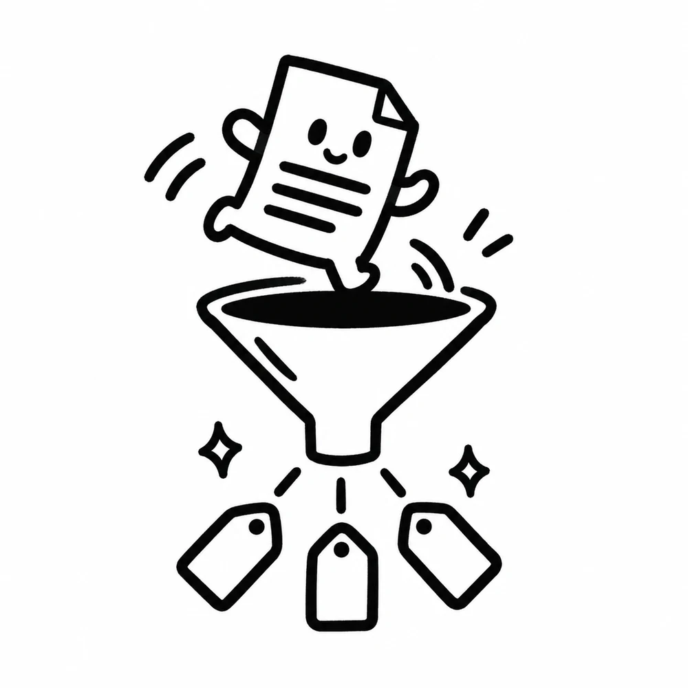
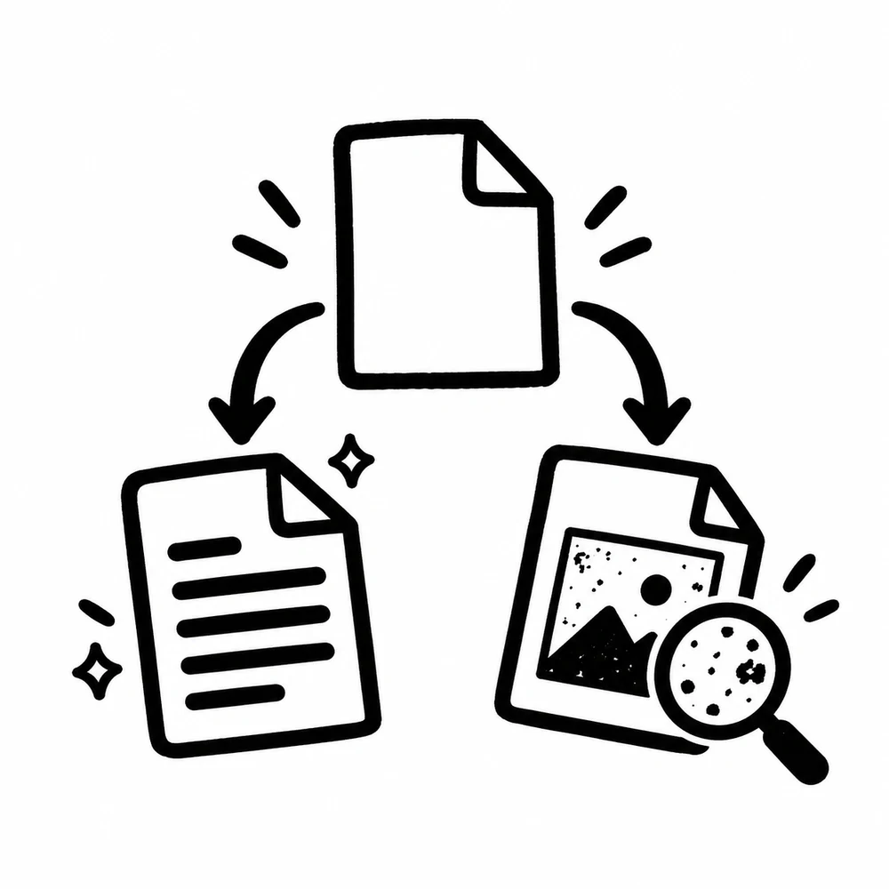
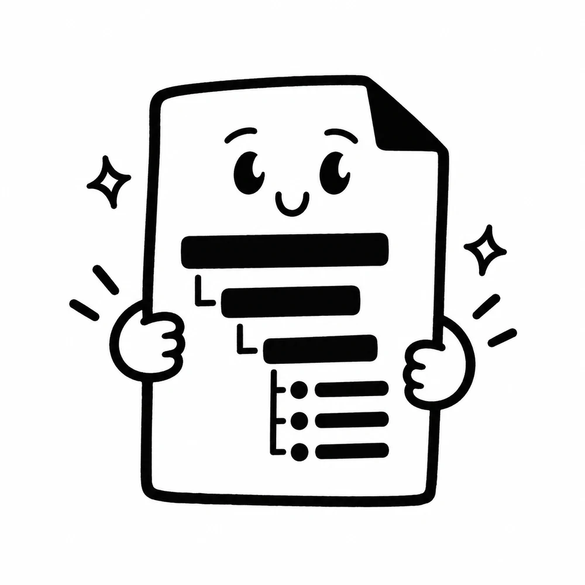
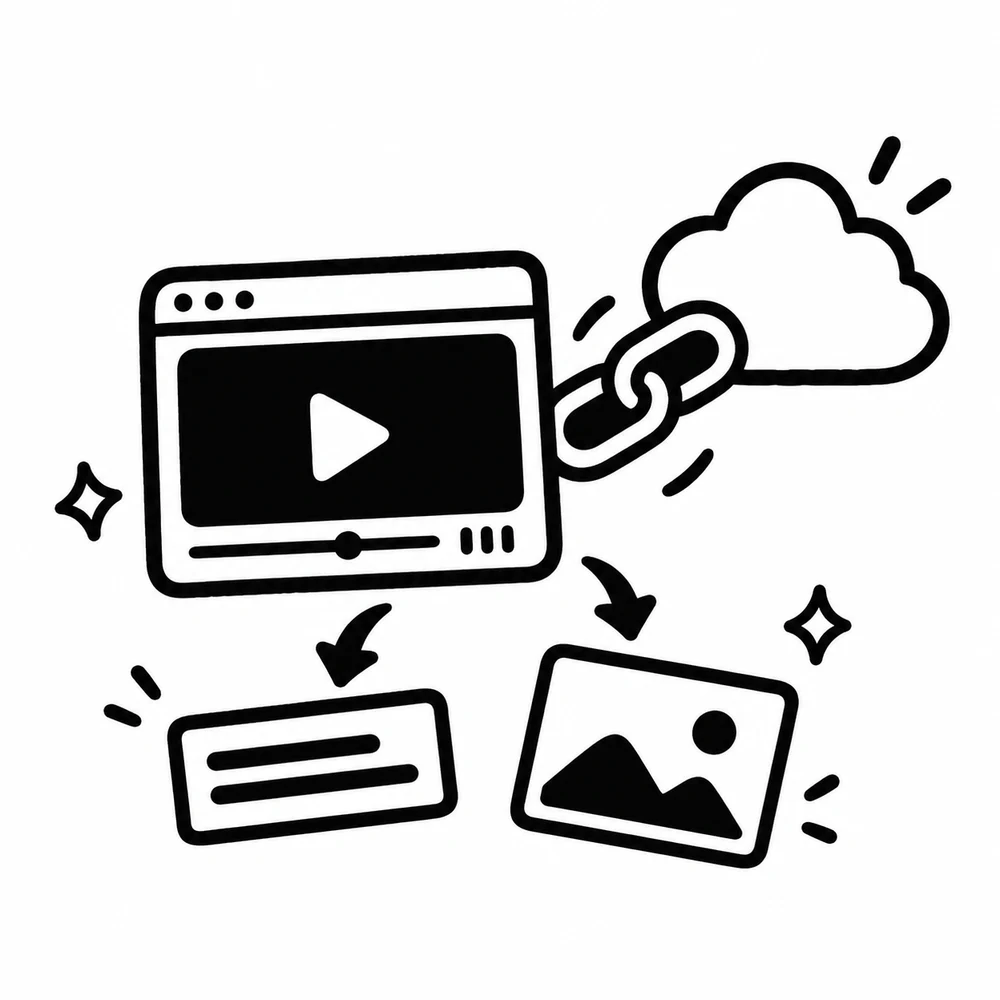
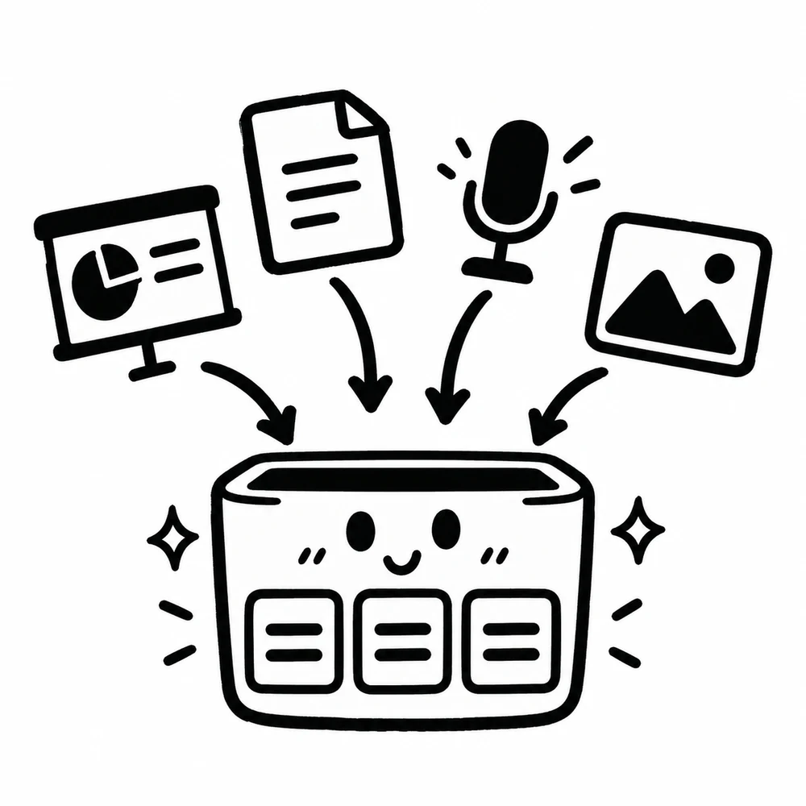
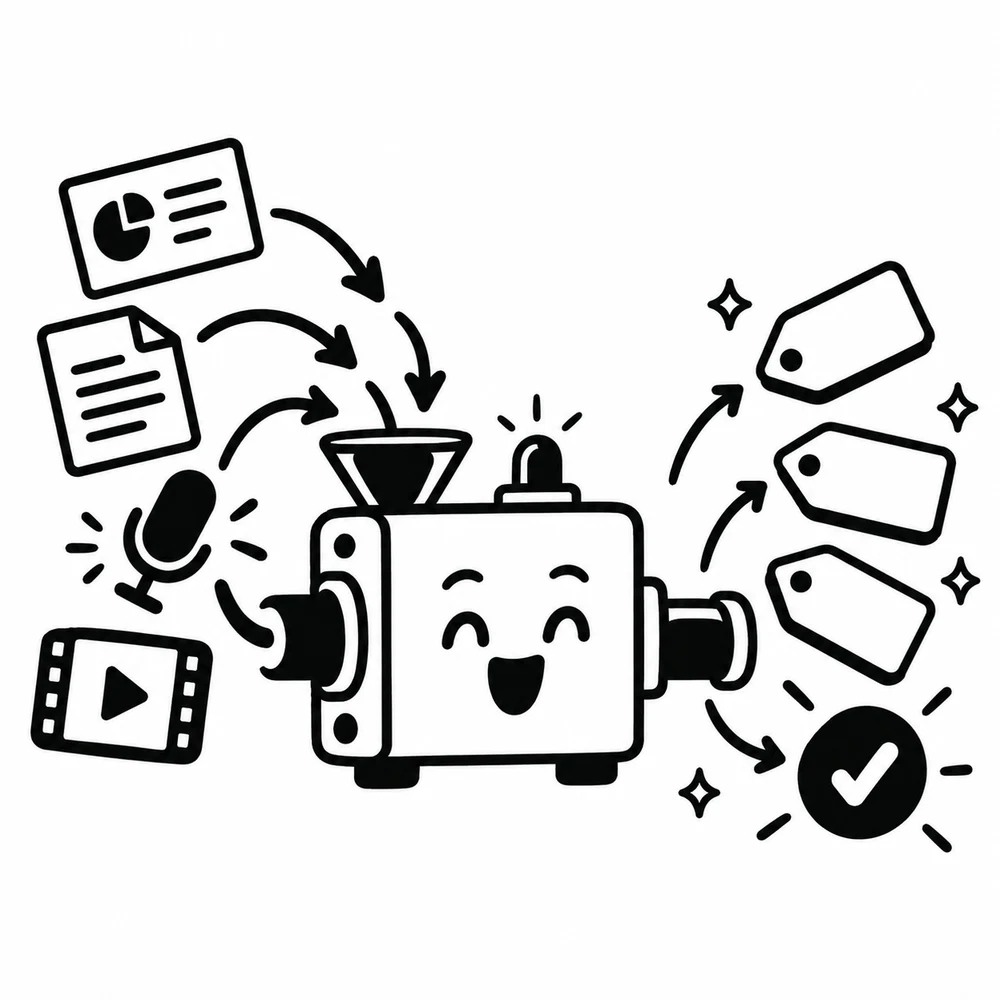

콘텐츠 메타 태깅 작업을 AI로 자동화하려고 하면 처음에는 단순한 문제처럼 보인다. 문서를 읽고, 주제를 파악하고, 적당한 태그를 붙이면 될 것 같다. 그런데 실제 데이터를 받아보면 금방 생각이 바뀐다.

어떤 파일은 PPT이고, 어떤 파일은 PDF다. 어떤 것은 Google Docs처럼 문단 구조가 살아 있고, 어떤 것은 스캔본이라 글자를 OCR로 다시 읽어야 한다. 영상 파일이나 강의 녹음처럼 ASR이 필요한 경우도 있고, 파일이 아니라 외부 YouTube 링크만 들어오는 경우도 있다. 심지어 같은 PDF라고 해도 텍스트가 살아 있는 PDF와 이미지로 굳어진 PDF는 완전히 다른 처리 대상이다.

그래서 메타 태깅에서 어려운 지점은 단순히 "AI가 태그를 잘 붙이는가"가 아니었다. 그보다 먼저 **서로 다른 콘텐츠 형식을 태깅 가능한 공통 표현으로 바꾸는 일**이 필요했다. 입력 형식이 흔들리면 뒤의 LLM 태깅 품질도 같이 흔들린다.

이번 글에서는 콘텐츠 메타 태깅 작업을 하면서 마주칠 수 있는 여러 콘텐츠 형식과 각 형식의 특징, 처리 기법을 정리하고, 마지막에는 이것을 AI agent 기반 데이터 처리 파이프라인으로 어떻게 설계할 수 있는지 간단히 정리해보려 한다.

## 메타 태깅은 추출 문제가 먼저다



메타 태깅이라고 하면 보통 마지막 단계만 떠올리기 쉽다.

```text
콘텐츠 -> AI 모델 -> 태그
```

하지만 실제 파이프라인에서는 이 구조가 바로 성립하지 않는다. AI 모델이 잘 처리할 수 있는 것은 대체로 정리된 텍스트, 표준화된 메타데이터, 충분한 문맥이다. 반면 원천 콘텐츠는 파일 형식, 레이아웃, 품질, 접근 방식이 제각각이다.

조금 더 현실적인 흐름은 다음에 가깝다.

```text
원천 콘텐츠
  -> 형식 판별
  -> 텍스트/구조/미디어 추출
  -> 정제와 정규화
  -> 청킹과 단위화
  -> AI 기반 메타 태깅
  -> 검증과 저장
```

즉 태깅 모델을 고도화하기 전에 먼저 콘텐츠를 읽을 수 있어야 한다. 그리고 단순히 글자를 뽑는 것만으로는 부족하다. 제목, 슬라이드 순서, 표, 캡션, 발화 시간, 페이지 번호, 원본 URL, 파일 버전 같은 정보가 함께 보존되어야 나중에 태그의 근거를 추적할 수 있다.

## 콘텐츠 형식별 특징과 처리 기법


다양한 콘텐츠를 다루다 보면 형식마다 잘 맞는 처리 방식이 다르다는 것을 알게 된다. 같은 "문서"라고 부르더라도 PPT, PDF, Docs는 데이터 구조가 다르고, 같은 "영상"이라고 해도 자막이 있는 영상과 없는 영상은 난이도가 다르다.

| 콘텐츠 형식 | 주요 특징 | 처리 기법 |
| --- | --- | --- |
| PPT / PPTX | 슬라이드 단위 구조가 명확하고 제목, 본문, 도형, 이미지, 발표자 노트가 섞여 있음 | 슬라이드 단위 추출, 제목/본문/노트 분리, 이미지 OCR, 슬라이드 순서 보존 |
| PDF | 텍스트 PDF와 스캔 PDF의 차이가 큼. 페이지, 표, 각주, 2단 레이아웃이 문제를 만들 수 있음 | 텍스트 추출 우선, 실패 시 OCR fallback, 페이지 단위 메타데이터 보존, 표 추출 별도 처리 |
| Docs / Word | 문단, heading, list, table 같은 문서 구조가 비교적 잘 살아 있음 | heading 기반 섹션 분할, 문단 스타일 보존, 표/링크/댓글 메타데이터 추출 |
| HTML / 웹페이지 | 본문 외에 메뉴, 광고, 추천글, footer 같은 노이즈가 많음 | 본문 영역 추출, boilerplate 제거, canonical URL과 수집 시각 저장 |
| 이미지 / 스캔본 | 텍스트가 이미지 안에 있으며 회전, 해상도, 손글씨, 복잡한 배경의 영향을 받음 | OCR, 이미지 전처리, 영역 탐지, OCR confidence 기반 검수 |
| 오디오 | 텍스트가 없고 발화자, 구간, 배경음, 음질에 따라 품질이 달라짐 | ASR, speaker diarization, 타임스탬프 보존, 문장 단위 정리 |
| 비디오 | 음성, 화면 텍스트, 장면, 자막이 함께 존재함 | ASR, 자막 추출, keyframe OCR, 장면 분할, 타임라인 단위 청킹 |
| YouTube 링크 | 파일이 아니라 외부 리소스이며 자막, 설명, 제목, 댓글, 접근 가능성이 변할 수 있음 | URL canonicalization, metadata fetch, caption 추출, 필요 시 ASR, 수집 시점 기록 |
| CSV / Excel | 행과 열 구조가 명확하지만 의미는 헤더와 시트 맥락에 의존함 | 시트/테이블 단위 추출, 헤더 정규화, 행 단위 또는 섹션 단위 요약 |
| 압축 파일 / 묶음 자료 | 여러 파일이 하나의 콘텐츠 패키지로 들어 있음 | 압축 해제, manifest 생성, 파일 간 관계 보존, 개별 처리 후 패키지 단위 태깅 |

이 표에서 중요한 것은 형식별 처리 기법이 서로 대체 관계가 아니라는 점이다. 실제 파이프라인에서는 여러 기법이 겹친다. 예를 들어 PPT 안의 이미지에는 OCR이 필요할 수 있고, YouTube 링크에는 자막 추출과 ASR이 모두 필요할 수 있다. PDF 안에 표가 있으면 일반 텍스트 추출과 표 구조 추출을 따로 해야 한다.

## PPT는 슬라이드 단위가 중요하다


PPT는 단순한 문서라기보다 화면 단위로 설계된 콘텐츠다. 그래서 텍스트를 한 덩어리로 뽑아내면 원래의 의미 구조가 쉽게 사라진다.

예를 들어 한 슬라이드의 제목은 주제 태그를 판단하는 데 매우 강한 신호다. 본문 bullet은 세부 개념을 담고, 발표자 노트는 슬라이드에 보이지 않는 설명을 담을 수 있다. 도형 안의 텍스트나 이미지 캡션도 놓치면 안 되는 경우가 많다.

PPT 처리에서는 보통 다음 단위를 분리해서 보는 것이 좋다.

- 슬라이드 번호
- 슬라이드 제목
- 본문 텍스트
- 표와 도형 텍스트
- 이미지 OCR 결과
- 발표자 노트
- 섹션 또는 챕터 정보

메타 태깅도 전체 파일 단위 태그와 슬라이드 단위 태그를 나눌 수 있다. 전체 파일에는 "중등 수학", "함수", "수업 자료" 같은 큰 태그가 붙고, 개별 슬라이드에는 "일차함수 그래프", "기울기", "절편" 같은 더 작은 태그가 붙는 식이다.

## PDF는 PDF라는 이름만으로 판단하면 안 된다



PDF는 가장 흔하지만 가장 까다로운 형식 중 하나다. 이유는 PDF가 콘텐츠의 논리 구조보다 출력 결과를 보존하는 데 초점이 있기 때문이다.

PDF에는 적어도 두 종류가 있다.

- 텍스트 레이어가 살아 있는 PDF
- 스캔 이미지로만 구성된 PDF

첫 번째는 비교적 쉽게 텍스트를 추출할 수 있다. 하지만 이 경우에도 2단 레이아웃, 머리말과 꼬리말, 페이지 번호, 각주, 표, 수식 때문에 순서가 꼬일 수 있다. 두 번째는 OCR 없이는 글자를 읽을 수 없다. OCR을 해도 해상도나 회전, 스캔 품질에 따라 결과가 흔들린다.

그래서 PDF 처리에서는 "PDF니까 텍스트 추출"이 아니라, 먼저 파일의 성격을 판별해야 한다.

```text
PDF 입력
  -> 텍스트 레이어 검사
  -> 충분한 텍스트가 있으면 native text extraction
  -> 텍스트가 부족하면 OCR
  -> 표와 이미지 영역은 별도 처리
  -> 페이지 번호와 bounding box 보존
```

특히 메타 태깅에서는 페이지 단위 근거가 중요하다. 나중에 "이 태그가 왜 붙었는가"를 설명하려면 태그의 근거가 어느 페이지, 어느 문단, 어느 표에서 나왔는지 되짚을 수 있어야 한다. PDF는 원본 확인이 자주 필요한 형식이므로 page number와 extraction method를 반드시 남겨두는 편이 좋다.

## Docs와 Word는 구조를 버리지 않는 것이 핵심이다



Google Docs나 Word 문서는 PDF보다 논리 구조가 잘 살아 있는 편이다. heading, paragraph, list, table, hyperlink 같은 요소를 비교적 안정적으로 추출할 수 있다. 이 장점은 메타 태깅에서 꽤 크다.

문서의 heading 구조를 활용하면 자연스러운 청킹이 가능하다.

```text
H1 문서 제목
  H2 섹션
    문단
    표
  H2 섹션
    문단
```

이런 구조가 있으면 단순히 1,000자 단위로 자르는 것보다 훨씬 안정적인 태깅이 가능하다. 섹션 제목은 태그 후보를 좁히는 데 도움이 되고, 표는 별도의 구조화 데이터로 다룰 수 있다.

다만 Docs류 문서에서도 주의할 점은 있다. 댓글, 제안 모드, 변경 이력, 링크, footnote 같은 부가 정보가 원문 이해에 영향을 줄 수 있다. 모든 정보를 태깅에 넣을 필요는 없지만, 최소한 어떤 정보를 사용했고 어떤 정보는 제외했는지 기록해두면 재처리와 검수에 도움이 된다.

## OCR은 텍스트 추출이 아니라 불확실성 관리다


이미지, 스캔 PDF, 화면 캡처, PPT 안의 이미지 텍스트를 다루려면 OCR이 필요하다. OCR은 글자를 뽑아준다는 점에서 편리하지만, 결과를 완전히 믿기는 어렵다.

OCR의 문제는 보통 다음에서 발생한다.

- 해상도가 낮거나 압축이 심한 이미지
- 기울어진 스캔본
- 표, 수식, 도표처럼 레이아웃이 복잡한 영역
- 손글씨
- 한국어와 영어, 숫자, 특수문자가 섞인 텍스트
- 배경 이미지 위에 올라간 작은 글자

따라서 OCR 결과는 항상 confidence와 함께 다루는 편이 좋다. confidence가 낮은 영역은 자동 태깅 근거로 강하게 쓰지 않거나, human review 대상으로 보내야 한다.

OCR 결과를 그대로 LLM에 넣기보다 후처리도 필요하다. 줄바꿈을 정리하고, 반복되는 머리말/꼬리말을 제거하고, 표처럼 보이는 영역은 일반 문장과 분리해야 한다. OCR이 틀린 단어는 LLM이 그럴듯하게 보정할 수도 있지만, 반대로 잘못된 태그를 더 자신 있게 만들 수도 있다. 이 부분이 OCR 기반 태깅의 위험한 지점이다.

## ASR은 시간축을 가진 텍스트를 만든다


오디오와 비디오는 ASR을 거치면 텍스트가 된다. 하지만 문서 텍스트와는 성격이 다르다. ASR 결과는 발화 시간, 발화자, 침묵 구간, 반복 표현, 말실수, 문장 경계의 불확실성을 함께 가진다.

예를 들어 강의 녹음을 태깅한다고 할 때, 단순 transcript 전체를 한 번에 요약하면 중요한 흐름을 놓치기 쉽다. 대신 시간 구간 단위로 나누는 것이 좋다.

```text
00:00-03:20 도입
03:20-12:45 핵심 개념 설명
12:45-18:10 예제 풀이
18:10-21:00 정리
```

이런 단위가 만들어지면 태그도 더 정확해진다. 전체 영상에는 큰 주제 태그를 붙이고, 구간별로 세부 개념 태그를 붙일 수 있다. 사용자가 나중에 검색했을 때 파일 전체가 아니라 해당 구간으로 이동시킬 수도 있다.

ASR 처리에서 중요한 메타데이터는 다음과 같다.

- 시작/종료 시간
- 발화자 정보
- ASR 모델과 언어 설정
- 자막 원본 사용 여부
- 신뢰도 또는 후처리 여부
- 영상/오디오 원본 URL 또는 파일 ID

시간축을 잃어버리면 오디오와 비디오는 그냥 긴 텍스트가 된다. 메타 태깅에서는 이 시간축이 검색, 검수, 근거 제시에 모두 중요하다.

## YouTube 링크는 외부 리소스라는 점이 다르다



YouTube 링크는 파일 업로드와 다르다. 콘텐츠가 내 저장소에 있는 것이 아니라 외부 플랫폼에 있고, 제목, 설명, 자막, 공개 상태가 바뀔 수 있다. 영상이 삭제되거나 비공개로 전환될 수도 있다.

따라서 YouTube 링크를 다룰 때는 먼저 수집 시점의 상태를 기록해야 한다.

- canonical URL
- video id
- 제목과 설명
- 채널명
- 업로드 날짜
- 수집 시각
- 자막 사용 여부
- 자동 자막인지 수동 자막인지
- ASR을 새로 수행했는지 여부

가능하면 공식 자막을 먼저 사용하고, 자막이 없거나 품질이 낮으면 ASR을 수행하는 식의 fallback 구조를 둘 수 있다. 영상 화면 안에 중요한 텍스트가 많은 콘텐츠라면 keyframe OCR도 고려할 수 있다. 예를 들어 강의 슬라이드 영상에서는 음성보다 화면의 수식이나 표가 더 중요한 경우도 있다.

YouTube 링크 기반 태깅에서 또 하나 중요한 것은 재현성이다. 오늘 수집한 자막과 한 달 뒤 수집한 자막이 같다는 보장이 없다. 그래서 태깅 결과에는 수집한 원문 스냅샷이나 transcript 버전을 함께 연결해두는 편이 좋다.

## 공통 표현으로 모으기



형식별 처리가 끝나면 결과를 하나의 공통 표현으로 모아야 한다. 이 공통 표현이 없으면 태깅 로직이 형식마다 흩어진다.

예를 들어 모든 콘텐츠를 다음과 같은 단위로 변환할 수 있다.

```text
Content
  - content_id
  - source_type
  - source_uri
  - title
  - author_or_owner
  - collected_at
  - language
  - extraction_method

Segment
  - segment_id
  - content_id
  - segment_type
  - order
  - text
  - page_number
  - slide_number
  - start_time
  - end_time
  - confidence
```

여기서 `Segment`는 문서의 문단, PDF의 페이지, PPT의 슬라이드, 영상의 시간 구간, Excel의 시트 요약처럼 다양한 단위를 담는 공통 그릇이다. 모든 형식이 같은 필드를 채울 필요는 없다. PDF는 page number를 채우고, 영상은 start_time과 end_time을 채우면 된다.

이 구조를 두면 AI 태깅은 훨씬 단순해진다.

```text
Segment text + Segment metadata + Content metadata
  -> tag candidates
  -> normalized tags
  -> evidence
```

중요한 것은 태그만 저장하지 않는 것이다. 태그의 근거가 된 segment, 사용한 모델, 프롬프트 버전, confidence, 검수 상태를 함께 저장해야 나중에 품질을 관리할 수 있다.

## AI agent 기반 파이프라인으로 설계하기

다양한 콘텐츠 형식을 다루는 파이프라인에서는 단일 함수형 배치보다 agent 기반 설계가 잘 맞는 경우가 있다. 이유는 입력마다 필요한 처리 경로가 달라지기 때문이다.

예를 들어 agent는 먼저 파일을 보고 판단해야 한다.

- 이 콘텐츠는 어떤 형식인가?
- 텍스트를 바로 추출할 수 있는가?
- OCR이나 ASR이 필요한가?
- 표, 이미지, 자막 같은 보조 추출이 필요한가?
- 태깅 전에 사람 검수가 필요한 품질인가?
- 기존 콘텐츠의 새 버전인가, 완전히 새로운 콘텐츠인가?

이 판단에 따라 각 도구를 호출하고, 결과를 비교하고, 실패하면 fallback을 시도하는 구조가 필요하다.

간단한 agent 파이프라인은 다음처럼 나눌 수 있다.

```text
1. Intake Agent
   입력 파일과 URL을 받고 source metadata를 만든다.

2. Router Agent
   파일 형식, MIME type, 확장자, 샘플 텍스트를 보고 처리 경로를 정한다.

3. Extraction Agent
   PPT, PDF, Docs, OCR, ASR, YouTube caption 등 형식별 추출 도구를 실행한다.

4. Normalization Agent
   추출 결과를 공통 Content / Segment 스키마로 변환한다.

5. Tagging Agent
   Segment와 Content 단위로 태그 후보, 요약, 키워드, 난이도, 도메인 분류를 생성한다.

6. Validation Agent
   태그 일관성, 금지 태그, confidence, 중복 콘텐츠, 근거 누락을 검사한다.

7. Review Agent
   낮은 confidence나 충돌 케이스를 사람 검수 큐로 보낸다.

8. Publishing Agent
   확정된 태그를 PostgreSQL, 검색 인덱스, 벡터 DB, 그래프 DB 등에 반영한다.
```

여기서 agent라는 말이 꼭 거대한 자율 시스템을 뜻할 필요는 없다. 핵심은 각 단계가 자기 역할과 입력/출력 계약을 가지고, 필요한 도구를 선택적으로 호출할 수 있다는 점이다.

## 파이프라인에서 꼭 남겨야 하는 것들


AI 기반 태깅 파이프라인은 결과 태그만 보면 깔끔해 보인다. 하지만 운영 관점에서는 중간 흔적을 남기는 것이 훨씬 중요하다.

| 기록해야 할 것 | 이유 |
| --- | --- |
| 원본 파일 또는 원본 URL | 재처리와 근거 확인을 위해 |
| 원천 수집 시각 | 외부 콘텐츠의 변경 가능성을 추적하기 위해 |
| 추출 방식 | native text, OCR, ASR, caption 등 품질 차이를 구분하기 위해 |
| 추출 모델과 버전 | 같은 원본을 재처리했을 때 결과 차이를 설명하기 위해 |
| segment 단위 | 태그의 근거 위치를 찾기 위해 |
| 태깅 모델과 프롬프트 버전 | 태그 결과의 재현성과 변경 이력을 위해 |
| confidence와 검수 상태 | 자동 처리와 사람 검수 대상을 나누기 위해 |
| taxonomy 버전 | 태그 체계가 바뀌었을 때 영향 범위를 알기 위해 |

특히 taxonomy version은 자주 놓치기 쉽다. 태그 체계는 생각보다 자주 바뀐다. 처음에는 "수학", "영어", "과학" 정도였던 태그가 나중에는 학년, 단원, 성취기준, 난이도, 콘텐츠 유형까지 확장될 수 있다. 이때 과거 태그가 어떤 기준으로 붙었는지 모르면 전체 재태깅이 필요한지, 일부 매핑만 바꾸면 되는지 판단하기 어렵다.

## 자동화와 검수의 경계를 정해야 한다

AI 태깅은 모든 것을 자동으로 끝내기보다, 자동화할 수 있는 부분과 검수가 필요한 부분을 분리하는 것이 현실적이다.

자동화하기 좋은 것은 다음과 같다.

- 파일 형식 판별
- 기본 메타데이터 추출
- 텍스트 추출과 청킹
- 후보 태그 생성
- 중복 콘텐츠 탐지
- taxonomy 매핑 후보 생성
- 낮은 품질 입력 탐지

반대로 검수가 필요한 것은 다음에 가깝다.

- OCR confidence가 낮은 스캔본
- ASR 품질이 낮은 음성
- 태그 후보끼리 충돌하는 콘텐츠
- 새 taxonomy가 필요한 콘텐츠
- 법적·정책적 민감도가 있는 콘텐츠
- 자동 태깅 결과가 서비스 노출에 직접 영향을 주는 콘텐츠

중요한 것은 human review를 실패 처리로 보지 않는 것이다. 오히려 검수 큐는 파이프라인의 일부다. AI agent가 자신이 확신할 수 없는 케이스를 사람에게 넘기고, 사람의 판단 결과를 다시 학습 데이터나 규칙 개선에 반영하면 전체 시스템이 안정된다.

## 태그는 정답이 아니라 운영되는 데이터다

메타 태깅을 한 번 해보면 태그가 단순한 label이 아니라는 것을 알게 된다. 태그는 검색 필터가 되고, 추천 피처가 되고, RAG의 retrieval 조건이 되고, 콘텐츠 운영 화면의 분류 기준이 된다.

그래서 태그를 붙이는 일은 단순한 LLM 호출이 아니라 데이터 모델링에 가깝다. 태그의 이름, 계층, 동의어, 폐기 여부, 버전, 적용 범위가 모두 중요하다.

예를 들어 "AI", "인공지능", "LLM", "생성형 AI"를 모두 별도 태그로 둘 것인지, 상하위 관계로 둘 것인지, 동의어로 묶을 것인지에 따라 검색과 추천 결과가 달라진다. 교육 콘텐츠라면 "분수", "약분", "통분", "분수의 덧셈" 같은 개념 관계도 신중히 다뤄야 한다.

결국 좋은 메타 태깅 파이프라인은 다음 세 가지를 함께 갖춰야 한다.

- 원천 콘텐츠를 안정적으로 읽는 추출 시스템
- 다양한 형식을 하나로 모으는 공통 스키마
- 태그 체계와 검수 흐름을 관리하는 운영 레이어

## 정리



처음에 정의한 태스크는 "AI로 태그를 붙인다"였지만, 실제로는 "AI가 읽을 수 있는 데이터로 만드는 파이프라인을 설계한다"는 태스크에 더 가까웠다. 
콘텐츠 메타 태깅에서 AI의 역할은 분명히 크다. LLM은 긴 문서를 요약하고, 주제를 파악하고, taxonomy에 맞는 태그 후보를 만들어내는 데 강하다. 하지만 AI가 잘 작동하려면 그 앞단에서 콘텐츠가 잘 읽혀야 한다.

PPT는 슬라이드 구조를 살려야 하고, PDF는 텍스트 PDF와 스캔 PDF를 구분해야 한다. Docs는 heading 구조를 활용해야 하고, OCR은 confidence와 검수를 함께 설계해야 한다. ASR은 시간축을 보존해야 하며, YouTube 링크는 외부 리소스의 변경 가능성과 수집 시점까지 기록해야 한다.

이 모든 것을 하나의 파이프라인으로 묶으려면 형식별 extractor를 따로 두되, 결과는 공통 Content / Segment 스키마로 수렴시키는 편이 좋다. 그 위에서 AI agent가 라우팅, 추출, 정규화, 태깅, 검증, 검수 큐 전달을 단계적으로 수행하면 다양한 콘텐츠 형식을 비교적 안정적으로 다룰 수 있다.

