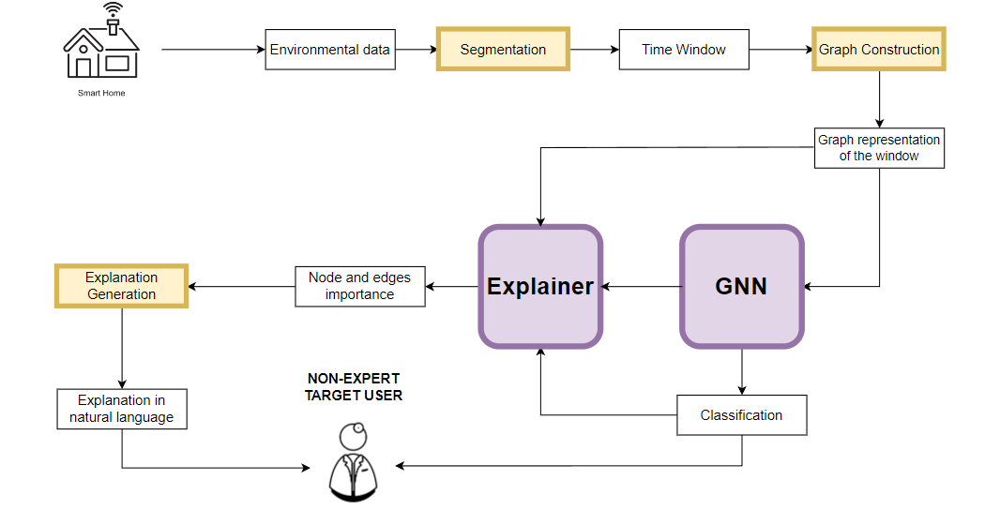
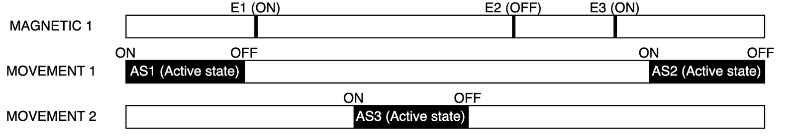
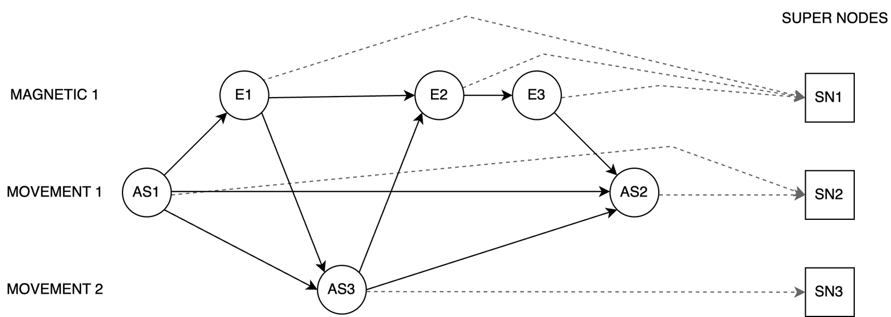
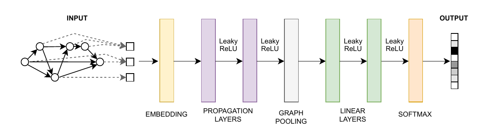
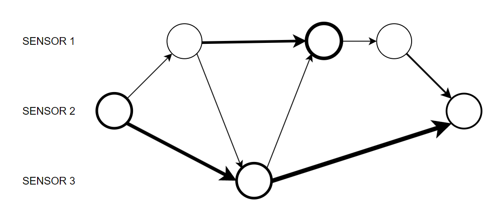
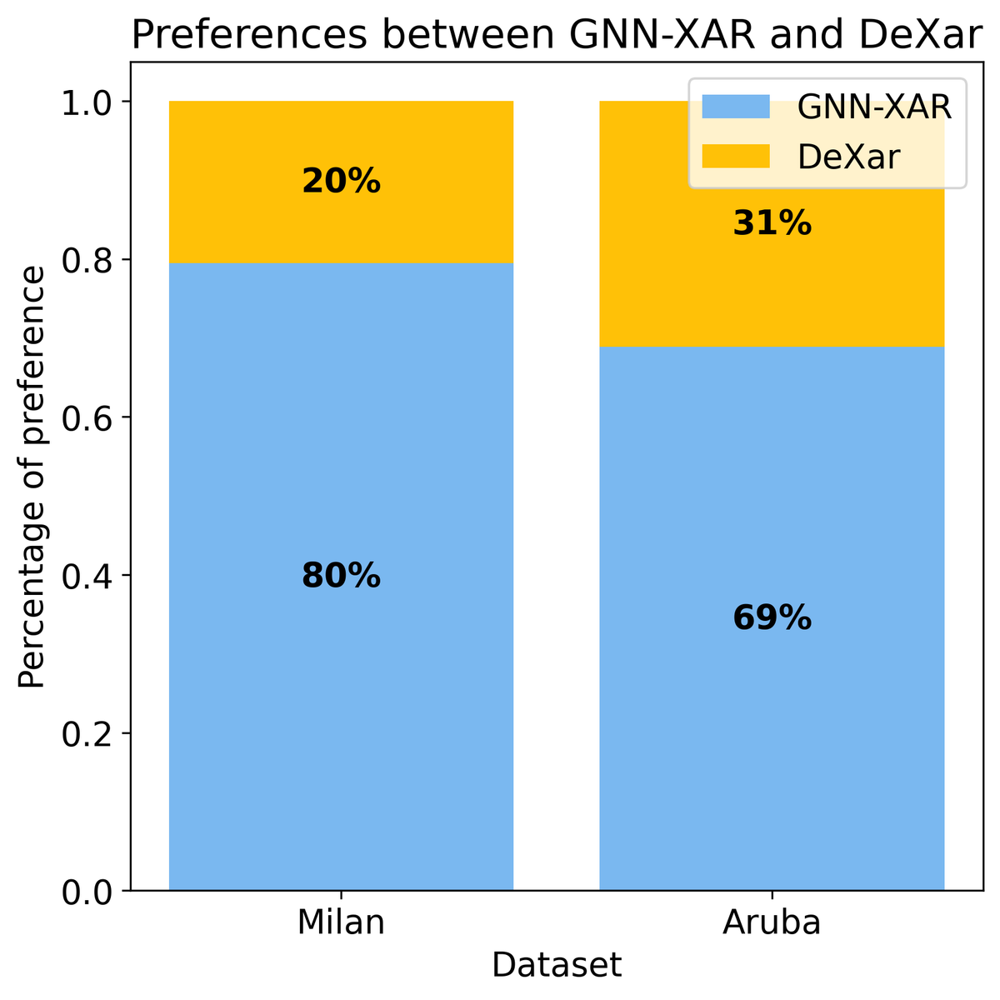

스마트홈 Human Activity Recognition(HAR)은 집 안의 모션 센서, 문 센서, 압력 센서 등을 이용해 거주자의 일상 활동(ADL)을 추론한다. 활동 인식 결과가 건강 모니터링이나 돌봄 의사결정에 활용된다면, 단순히 `Sleep`이나 `Leave Home`이라는 예측값만 내는 것으로는 부족하다. 어떤 센서 이벤트와 순서 때문에 그런 결론을 냈는지도 설명할 수 있어야 한다.

[GNN-XAR: A Graph Neural Network for Explainable Activity Recognition in Smart Homes](https://arxiv.org/abs/2502.17999)는 이 문제를 위해 센서 이벤트 윈도를 **시간적 의미가 보존된 방향 그래프**로 바꾸고, 같은 그래프에서 활동 분류와 자연어 설명을 모두 얻는 방법을 제안한다. (2026년 1월 5일 arXiv v2 기준)



_그림: 논문 Figure 1. 센서 데이터 윈도를 그래프로 변환해 활동을 분류하고, 중요 노드와 엣지로 자연어 설명을 생성한다._


## 논문의 구조적 흐름

논문은 다음 순서로 논리를 전개하고 있다.

1. CNN·RNN 기반 스마트홈 HAR은 분류 성능은 높지만 판단 근거가 불투명하다.
2. 기존 GNN 기반 HAR도 그래프의 엣지에 해석 가능한 의미가 없거나, 긴 이벤트 순서를 충분히 설명하기 어렵다.
3. 센서 이벤트의 선후관계와 시간 간격을 명시한 방향 그래프를 동적으로 구성한다.
4. 센서별 슈퍼 노드로 가변 크기 그래프를 고정 크기 표현으로 바꾸고 활동을 분류한다.
5. GNNExplainer로 중요한 노드와 엣지를 고른 뒤, 중요한 이벤트 경로를 자연어 설명으로 변환한다.
6. CASAS Milan과 Aruba에서 분류 F1과 설명 선호도를 DeXAR와 비교한다.

핵심 주장은 “그래프를 사용하면 성능이 오른다”보다 조금 더 구체적이다. **센서 이벤트의 공간적 위치와 시간적 순서를 해석 가능한 그래프로 표현하면, 동적 활동의 분류와 설명을 동시에 개선할 수 있다**는 것이다.

## 모델 전체 구조

GNN-XAR의 파이프라인은 크게 다섯 단계다.

```text
binary sensor stream
  -> 360초 overlapping window
  -> heuristic graph construction
  -> GNN message passing + super-node pooling
  -> ADL classification
  -> GNNExplainer + heuristic natural-language explanation
```

입력은 모션, 자기, 압력 센서처럼 ON/OFF 값을 내는 이진 환경 센서다. 논문은 단일 거주자와 센서 이벤트의 total order를 가정한다. 게이트웨이가 이벤트를 큐에 넣으며 서로 다른 timestamp를 부여하므로, 실제로 동시에 발생한 것처럼 보이는 이벤트에도 순서를 정할 수 있다는 설명이다.

### 1. 이벤트 윈도 만들기

연속 센서 스트림은 360초 길이의 고정 윈도로 분할되며, 인접 윈도는 80% 겹친다. 따라서 새 윈도는 72초마다 시작한다.

```text
360초 × (1 - 0.8) = 72초
```

활동 라벨이 없는 전환 구간과 센서 이벤트가 하나도 없는 윈도는 버린다. 이 선택은 학습 샘플을 정리해주지만, 실제 배포 환경에서 활동 전환과 무활동 구간도 처리해야 한다는 점을 생각하면 평가 조건을 다소 쉽게 만든다.

#### 왜 360초인지?

처음 읽으면서 가장 먼저 든 질문은 360초, 즉 6분 윈도의 근거였다.

결론부터 말하면 **GNN-XAR가 360초를 최적값으로 새로 찾은 것은 아니다.** 같은 CASAS 데이터와 비교 모델을 사용한 DeXAR의 설정을 그대로 가져왔다. 비교 조건을 맞춘다는 실용적 이유는 있지만 다음 검증은 없다.

- 60·180·360·600초와 같은 window size 비교
- 활동 지속시간을 근거로 한 이론적 선택
- window size와 overlap 민감도 분석
- 변화점 탐지 기반 dynamic segmentation과 비교

6분 윈도는 긴 활동 문맥을 담을 수 있지만 여러 활동이나 전환 구간이 섞일 가능성도 높인다. 80% overlap은 샘플 수를 늘리는 대신 비슷한 윈도를 대량 생성한다. 따라서 이 실험으로 “360초가 최적”이라고 결론 내릴 수 없다. 저자들도 future work에서 dynamic segmentation을 검토하겠다고 밝힌다.

### 2. 이벤트를 노드로 바꾸기

센서 종류에 따라 노드를 만드는 방법이 다르다.

- 문·서랍 센서처럼 사용자의 명시적 행동으로 ON과 OFF가 모두 발생하면 각각을 **event node**로 만든다.
- 모션 센서처럼 일정 시간 뒤 자동으로 꺼지는 센서는 ON부터 OFF까지를 하나의 **state node**로 만들고 활성 지속시간을 특성으로 넣는다.
- 모든 노드는 센서 ID를 특성으로 가지며, trainable embedding layer가 이를 벡터로 바꾼다.

즉, 같은 모션 센서가 잠깐 반응했는지 오래 활성 상태였는지는 state node의 duration으로 구분된다.



_그림: 논문 Figure 4. 자기 센서는 개별 이벤트, 모션 센서는 활성 상태와 지속시간으로 표현된다._


#### 슈퍼 노드란..?

윈도마다 이벤트 수가 다르므로 그래프의 노드 수도 달라진다. 이 상태로 노드 임베딩을 이어 붙이면 분류기의 입력 크기를 고정할 수 없다. GNN-XAR는 이를 해결하기 위해 **물리적 센서마다 하나의 가상 슈퍼 노드(super-node)**를 추가한다.

```text
현관문 event 1 ─┐
현관문 event 2 ─┼─> 현관문 super-node
현관문 event 3 ─┘

주방 motion state ──> 주방 motion super-node
```

각 event/state node는 자신을 생성한 센서의 슈퍼 노드로 연결된다. 특정 윈도에서 작동하지 않은 센서도 슈퍼 노드는 존재하지만 연결된 이벤트가 없는 고립 노드가 된다.



_그림: 논문 Figure 5. 원은 event/state node, 사각형은 센서별 super-node다. 실선은 시간 엣지, 점선은 센서별 집계 엣지다._

슈퍼 노드는 두 역할을 동시에 한다.

- **센서별 정보 집계:** 해당 센서에서 발생한 이벤트와 주변 이벤트의 정보를 모은다.
- **고정 크기 pooling:** 센서 수는 고정이므로 모든 슈퍼 노드 임베딩을 이어 붙이면 항상 같은 길이의 그래프 표현을 얻는다.

일반적인 global virtual node 하나가 그래프 전체를 모으는 방식과 달리, 이 모델은 센서마다 하나씩 둔다는 점이 중요하다. 덕분에 그래프를 고정 크기로 만들면서도 “어느 센서의 이벤트가 중요했는가”라는 설명 경로를 보존한다.

### 3. 시간 의미가 있는 방향 엣지 만들기

GNN-XAR는 모든 노드를 완전 연결하지 않는다. 다음 세 규칙으로 sparse directed graph를 만든다.

1. 같은 센서에서 연속으로 발생한 event node를 연결한다.
2. 같은 센서에서 연속으로 발생한 active state node를 연결한다.
3. 서로 다른 두 센서 사이에서는, 해당 두 센서의 다른 이벤트나 상태가 사이에 없을 때 두 노드를 연결한다.

엣지 `v_i -> v_j`는 `v_i`의 이벤트가 `v_j`보다 먼저 발생했다는 뜻이다. 엣지 특성에는 두 timestamp의 차이 `Δt = t_j - t_i`가 들어간다. 순서가 같은 두 이벤트 흐름이라도 2초 간격인지 2분 간격인지 모델이 구분할 수 있다.

서로 다른 위치의 센서가 연결되면 이 엣지는 공간 관계도 간접적으로 담는다. 예를 들어 복도 모션 센서 다음 현관 센서가 작동한 엣지는 시간적 이동 순서와 집 안 위치 변화를 동시에 나타낸다.

#### 그래서 시간 정보는 정확히 어디에 들어가나?

GNN-XAR는 RNN이나 Transformer의 positional encoding을 사용하지 않는다. 대신 시간 정보를 그래프의 세 위치에 나눠 넣는다.

| 시간 정보             | 그래프 표현                                           |
| --------------------- | ----------------------------------------------------- |
| 이벤트 선후관계       | 먼저 발생한 노드에서 나중 노드로 향하는 directed edge |
| 이벤트 사이 실제 간격 | edge feature의 `Δt`                                   |
| 센서 활성 지속시간    | state node의 duration feature                         |

이 구조에서는 `복도 모션 -> 현관문 열림`과 `현관문 열림 -> 복도 모션`이 다른 그래프다. 순서가 같아도 2초 간격과 120초 간격은 edge feature가 다르다. 이 점은 sensor dependency를 학습하되 fire 순서를 엣지 의미로 쓰지 않았던 [Know Thy Neighbors](https://arxiv.org/abs/2311.09514)와 가장 크게 구분되는 부분이다.

다만 장기 시간 문맥은 없다. 오전인지 밤인지, 바로 전 활동이 무엇이었는지, 평소 생활 루틴이 어떤지는 입력하지 않는다. 동일 공간에서 일어나는 `Bathroom`과 `Dress/Undress`를 구별하지 못한 결과가 이 한계를 보여준다.


## GNN 내부: 두 단계 message passing

첫 번째 propagation 단계는 node embedding과 edge feature를 함께 처리한다. 개념적으로는 source node 표현과 시간 차이 `Δt`를 연결한 뒤 linear layer를 통과시키고, 목적지 노드로 들어오는 메시지를 합산한다.

```text
message(i -> j) = Linear(node_embedding_i || Δt_ij)
updated_node_j  = node_j + Sum(message(i -> j))
```

두 번째 단계는 새 node embedding만 합산해 더 멀리 전파한다. 논문은 그래프 연결성이 높아 적은 propagation 횟수로도 슈퍼 노드까지 정보가 전달된다고 설명한다.



_그림: 논문 Figure 6. embedding과 propagation을 거친 뒤 super-node만 pooling하고, 두 linear layer와 softmax로 활동을 분류한다._

pooling은 슈퍼 노드 임베딩만 순서대로 concatenate한다. 그 결과 벡터의 길이는 `sensor 수 × embedding dimension`으로 고정된다. 이 벡터는 LeakyReLU가 뒤따르는 두 linear layer와 softmax를 거쳐 ADL 확률이 된다.

### 설명은 어떻게 만드는지..?

분류가 끝나면 수정된 GNNExplainer가 예측에 중요한 subgraph를 찾는다.

원래 GNNExplainer는 node feature와 edge에 각각 mask를 학습한다. 하지만 GNN-XAR의 sensor ID는 범주형 특성이라, 여기에 0과 1 사이의 연속 mask를 곱하면 의미가 불분명해진다. 저자들은 직접적인 node mask 대신 **event/state node와 해당 super-node를 연결하는 엣지의 중요도**를 그 노드의 중요도로 사용한다.

GNNExplainer는 비결정적이기 때문에 여러 번 실행한 mask의 평균을 사용한다. node score와 edge score의 범위가 달라 edge score를 두 집단의 평균이 같아지도록 rescale하고, 중요도 기준으로 clustering한 뒤 가장 높은 cluster의 노드와 엣지를 선택한다. 다만 논문은 반복 실행 횟수나 clustering의 상세 설정을 충분히 보고하지 않는다.



_그림: 논문 Figure 8. 굵기가 중요도를 나타낸다. 최종 설명에서는 super-node 연결을 노드 중요도로 치환한다._

마지막으로 중요한 엣지들의 longest path를 구하고, 규칙 기반 템플릿으로 자연어를 만든다. 반복 센서 반응은 “여러 번 접근했다”와 같은 표현으로 바뀐다.

여기서 LLM의 역할을 구분할 필요가 있다.

```text
설명 생성: longest path + 규칙 기반 템플릿
설명 평가: LLM이 GNN-XAR와 DeXAR 설명 중 하나를 선택
```

즉, 논문의 자연어 설명 자체를 LLM이 생성하는 것은 아니다.

## 실험 조건

평가는 공개 스마트홈 데이터인 CASAS Milan과 CASAS Aruba에서 진행됐다.

| 데이터셋 | 환경                                             | 전처리 후 평가 활동 |
| -------- | ------------------------------------------------ | ------------------: |
| Milan    | 여성 1명, 반려동물, 자녀의 간헐적 방문, 약 3개월 |                 9개 |
| Aruba    | 여성 1명, 자녀·손주의 정기적 방문                |                 9개 |

Milan은 희소한 5개 활동을 제외하고 두 bathroom class를 하나로 합쳤다. Aruba는 `Resperate`와 `Bed to Toilet`을 제외했다. 논문은 단일 거주자를 가정하지만 데이터에는 반려동물이나 방문자가 포함되어 있어, 센서 반응이 항상 거주자 한 사람에게서만 왔다고 보기는 어렵다.

비교 대상은 센서 데이터를 semantic image로 바꾸고 CNN과 LIME으로 설명하는 **DeXAR** 하나다. 공정한 비교를 위해 과거 예측 활동을 입력으로 쓰는 DeXAR의 원래 설정은 제거했다.

| 항목           | 설정                                      |
| -------------- | ----------------------------------------- |
| 데이터 분할    | train 70% / test 20% / validation 10%     |
| 윈도           | 360초, 80% overlap                        |
| 제외 샘플      | 라벨 없는 전환 구간, 이벤트 없는 윈도     |
| optimizer      | Adam                                      |
| learning rate  | 0.0001                                    |
| loss           | CrossEntropy                              |
| early stopping | patience 50 epochs                        |
| 구현           | Python 3.10.5, PyTorch, PyTorch Geometric |

논문은 split을 “standard 70/20/10”이라고만 적고 시간순 분할인지 random split인지 명확히 밝히지 않는다. 80% 중첩 윈도는 이 부분과 함께 봐야 한다. 중첩 윈도를 먼저 만든 뒤 무작위로 나눴다면, 288초를 공유하는 매우 유사한 샘플이 train과 test에 동시에 들어갈 수 있기 때문이다. seed, batch size, 전체 epoch, 하드웨어도 보고되지 않았다.

## 분류 결과

전체 weighted F1은 두 데이터셋 모두 GNN-XAR가 높다.

| 데이터셋    | DeXAR |  GNN-XAR |  차이 |
| ----------- | ----: | -------: | ----: |
| CASAS Milan |  0.77 | **0.81** | +0.04 |
| CASAS Aruba |  0.90 | **0.92** | +0.02 |

평균 성능 차이는 작지만, 이벤트 순서가 중요한 출입 활동에서는 차이가 크다.

| 활동               | DeXAR |  GNN-XAR |
| ------------------ | ----: | -------: |
| Milan `Leave Home` |  0.46 | **0.74** |
| Aruba `Enter Home` |  0.53 | **0.76** |
| Aruba `Leave Home` |  0.71 | **0.82** |

이는 방향 엣지로 이벤트 순서를 표현한다는 설계 의도와 잘 맞는다. 반대로 모든 활동이 좋아진 것은 아니다.

| 활동                |    DeXAR | GNN-XAR |
| ------------------- | -------: | ------: |
| Milan `Eat`         | **0.67** |    0.61 |
| Milan `Work`        | **0.80** |    0.70 |
| Aruba `Wash Dishes` | **0.06** |    0.00 |

Milan의 `Bathroom`과 `Dress/Undress`처럼 같은 공간에서 일어나는 활동은 두 모델 모두 어려워한다. 논문은 과거 활동이나 시각 같은 추가 context가 필요하다고 본다. Aruba의 `Wash Dishes`와 `Housekeeping`은 매우 희소해 사실상 제대로 분류되지 않는다. weighted F1만 보면 이런 소수 class 실패가 가려진다.

## 설명 평가 결과

저자들은 활동별로 **정답을 맞힌 윈도 30개**를 무작위 표본으로 뽑고, LLM에게 같은 입력에 대한 GNN-XAR와 DeXAR 설명 중 더 나은 것을 고르게 했다.



_그림: 논문 Figure 11. LLM은 Milan에서 80%, Aruba에서 69%의 사례에 GNN-XAR 설명을 선택했다._

- CASAS Milan: GNN-XAR 설명 선호 80%
- CASAS Aruba: GNN-XAR 설명 선호 69%

출입, 식사, 요리처럼 이동 순서가 중요한 동적 활동에서 GNN-XAR의 선호도가 높았다. 반면 Aruba의 `Sleep`에서는 DeXAR가 이겼다. 침실의 여러 센서가 수면 중 작은 움직임에 반응하면서, GNN-XAR가 실제 이동이 없는데도 센서 사이를 이동한 것처럼 서술했기 때문이다.

이 결과는 유망하지만 “모델 판단에 더 충실한 설명”을 입증하지는 않는다. LLM이 구체적이고 서사적인 문장을 선호했을 가능성이 있고, 평가 예시에서는 센서에 없는 행동까지 상식으로 추측한다. 사람 평가, fidelity·sparsity·stability 지표, 오분류 설명 평가는 수행하지 않았다. 평가에 사용한 LLM과 실행 설정도 본문에 구체적으로 보고되지 않는다.


## 좋았던 점

첫째, 설명 가능성을 사후에만 덧붙이지 않고 graph construction 단계에서 고려했다. 엣지가 “두 이벤트 중 무엇이 먼저 발생했고 얼마나 떨어져 있는가”라는 의미를 가지므로, 중요한 subgraph를 사람이 읽을 수 있는 이벤트 흐름으로 바꾸기 쉽다.

둘째, 센서별 슈퍼 노드 설계가 pooling과 설명을 동시에 해결한다. 가변 개수의 이벤트를 고정 크기 벡터로 만들면서도 이벤트가 어느 센서의 판단 근거로 모였는지 추적할 수 있다.

셋째, 출입 활동의 큰 개선은 모델 설계와 결과가 논리적으로 연결되는 사례다. temporal order가 중요한 class에서 성능과 설명 선호도가 함께 오른다.

넷째, 자연어 생성이 규칙 기반이라는 점은 의료·돌봄 환경에서 장점이 될 수 있다. LLM 생성보다 표현력은 낮지만, 센서에 없는 내용을 자유롭게 만들어낼 위험은 상대적으로 작다.

## 아쉬운 점

가장 큰 한계는 비교 범위다. 수정된 DeXAR 하나만 비교해 개선이 GNN, graph construction, super-node, edge time feature 중 어디서 왔는지 분리할 수 없다. RNN·Transformer·일반 GCN이나 다른 GNN explanation 방법과의 비교, 구성요소별 ablation이 필요하다.

두 번째는 데이터 분할과 재현성이다. 80% 중첩 윈도에서 split 순서가 불명확하고, seed·반복 실험·분산·세부 학습 설정·공개 구현이 충분히 제공되지 않았다. 특히 시간순 분할이 아니라면 누수 가능성을 배제하기 어렵다.

세 번째는 설명 평가다. 올바른 예측만 대상으로 LLM 선호도를 측정했기 때문에, 설명이 실제 모델 판단에 충실한지보다 얼마나 구체적이고 그럴듯한지를 평가했을 수 있다. GNNExplainer의 비결정성에 대한 실행 횟수와 결과 분산도 필요하다.

네 번째는 적용 범위다. 이진 센서와 단일 거주자를 가정하고 두 집만 평가했다. 연속 센서, 웨어러블, 다인 가구, 반려동물, 센서 고장, 다른 주택 배치로의 일반화는 확인되지 않았다.

마지막으로 고정 윈도와 라벨 없는 전환 구간 제거는 온라인 환경의 어려움을 그대로 반영하지 못한다. 모델이 실제 스트림에서 활동 시작과 종료, 무활동, 전환을 어떻게 처리할지는 별도 문제로 남는다.

## 정리

GNN-XAR는 센서 이벤트를 단순한 feature sequence가 아니라 **설명 가능한 시공간 그래프**로 설계한다. 이벤트 순서는 엣지 방향, 시간 간격은 엣지 특성, 활성 지속시간은 노드 특성으로 들어간다. 센서별 슈퍼 노드는 이 정보를 고정 크기 표현으로 모으고, GNNExplainer가 선택한 중요 경로는 규칙 기반 자연어 설명으로 바뀐다.

결과를 보수적으로 요약하면 다음과 같다.

> 두 개의 단일 거주자 중심 CASAS 데이터셋에서, 시간 의미를 명시한 이벤트 그래프는 DeXAR보다 weighted F1을 소폭 높였고, 특히 출입 활동에서 큰 개선을 보였다. 생성된 설명은 LLM 비교에서 더 자주 선택됐다.

GNN-XAR의 가장 설득력 있는 부분은 GNN 자체보다 **설명에 사용할 수 있도록 엣지의 의미를 먼저 설계한 것**이다. 다만 두 데이터셋과 단일 비교 모델, LLM 선호도 평가만으로 설명의 충실도까지 입증했다고 보기는 어렵다.

이 논문의 가장 중요한 메시지는 “GNN을 쓰면 설명 가능해진다”가 아니다. **설명하고 싶은 단위와 관계를 먼저 그래프의 노드와 엣지 의미로 설계해야 한다**는 것이다. 그 방향은 설득력 있지만, 실제 돌봄 시스템에 적용하려면 시간순 데이터 분할, ablation, 다인 가구 평가, 인간 대상 설명 평가와 fidelity 검증이 더 필요하다.


## References

- Michele Fiori, Davide Mor, Gabriele Civitarese, Claudio Bettini, [GNN-XAR: A Graph Neural Network for Explainable Activity Recognition in Smart Homes](https://arxiv.org/abs/2502.17999), arXiv:2502.17999, 2025.
- Michele Fiori et al., [MobiQuitous 2024 published version](https://doi.org/10.1007/978-3-032-10554-7_19), Springer LNCS, 2026.
- Rex Ying et al., [GNNExplainer: Generating Explanations for Graph Neural Networks](https://arxiv.org/abs/1903.03894), NeurIPS 2019.
