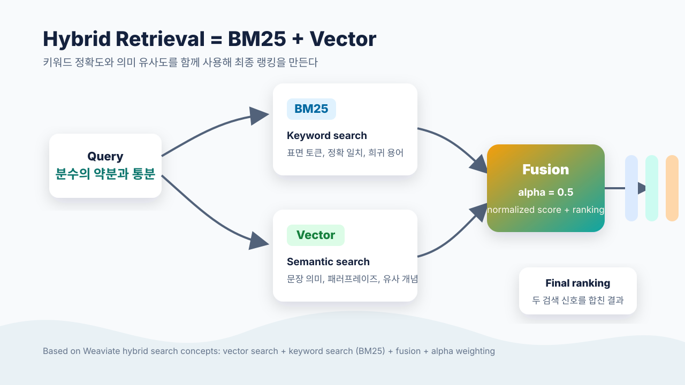

실무에서 Graph RAG와 Vector RAG를 함께 사용하는 구조를 다루고 있는데, 이것을 자연스럽게 "하이브리드 RAG"와 혼용하는 경우가 있었다. 나도 처음에는 여러 검색 방식을 섞는다는 의미에서는 그렇게 말해도 되지 않을까 싶었다.

그런데 막상 Weaviate의 hybrid search를 구현하면서 조금 헷갈렸다. 검색 엔진에서 말하는 Hybrid Retrieval은 보통 Graph + Vector가 아니라 **Keyword + Vector**, 더 구체적으로는 **BM25 같은 lexical 검색과 dense vector 검색을 결합하는 방식**을 가리킨다.

그래서 이번에는 용어를 정리할 겸, 실제 교육과정 청크를 대상으로 BM25, Vector, Hybrid 검색을 같은 질의로 비교헸던 실험을 기록해보고자 한다. 

## 먼저 용어부터 정리하기

Hybrid Search 또는 Hybrid Retrieval이라고 하면, 관용적으로는 다음 조합을 뜻한다.

```text
Keyword / BM25 / Sparse retrieval
  + Dense vector retrieval
  = Hybrid Search
```

반면 Graph + Vector를 결합하는 구조는 보통 GraphRAG, graph-augmented retrieval, 또는 graph + vector retrieval이라고 부르는 편이 더 명확하다.

| 조합 | 더 적절한 이름 | Hybrid라고 불러도 될까? |
| --- | --- | --- |
| Keyword(BM25) + Vector | Hybrid Search / Hybrid Retrieval | 정확히 이 뜻에 가깝다 |
| Graph + Vector | GraphRAG / graph-augmented retrieval | 넓은 의미로 가능하지만 모호하다 |
| Vector + Reranker | 2-stage retrieval / cascade retrieval | 보통 hybrid라고 부르지 않는다 |

물론 hybrid라는 단어 자체는 여러 방식을 섞는다는 넓은 의미를 가진다. 그래서 Graph + Vector를 "하이브리드"라고 말하는 것이 완전히 틀렸다고 보기는 어렵다. 다만 검색 시스템 문맥에서 별다른 수식어 없이 Hybrid Retrieval이라고 하면, 듣는 사람은 대체로 BM25 + Vector를 떠올릴 가능성이 높다.

내가 다루던 시스템에는 실제로 두 층이 모두 있었다.

```text
검색 엔진 내부
  Weaviate: BM25 + Vector = Hybrid Search

오케스트레이션 레이어
  Neo4j + Weaviate = GraphRAG
```

따라서 문서에서는 둘을 분리해서 쓰는 편이 안전하다.

- **Hybrid Search / Hybrid Retrieval**: Weaviate 내부의 BM25 + Vector 검색
- **GraphRAG 또는 graph + vector 검색**: Neo4j 그래프 신호와 벡터 검색을 함께 쓰는 상위 검색 구조



_참고: Weaviate 공식 문서의 [Hybrid search 개념](https://docs.weaviate.io/weaviate/concepts/search/hybrid-search)과 [Hybrid search fusion 설명](https://weaviate.io/blog/hybrid-search-fusion-algorithms)을 바탕으로 정리한 도식._

이번 노트북에서 비교한 대상은 전자, 즉 BM25 + Vector 조합으로서의 Hybrid Retrieval이다.

## 실험 목적

Weaviate에 적재된 교육과정 청크를 대상으로 같은 질의를 세 방식으로 검색했다.

- 순수 키워드 검색: BM25
- 순수 시맨틱 검색: Vector
- Hybrid 검색: BM25 + Vector

비교하고 싶었던 것은 단순한 성능 점수 하나가 아니라, **어떤 방식이 정답 성취기준을 더 안정적으로 상위에 올리는가**였다.

실험 설정은 다음과 같다.

| 항목 | 값 |
| --- | --- |
| 컬렉션 | `Curriculum_Standard_Detail` |
| 데이터 | 내용체계·성취기준 청크 73건 |
| 임베딩 모델 | `dragonkue/BGE-m3-ko` |
| 벡터 차원 | 1024 |
| 검색 방식 | Weaviate native `query.hybrid(query, vector, alpha)` |
| 질의 | `분수의 약분과 통분` |
| 정답 성취기준 | `6수01-06` |

Weaviate의 `alpha`는 BM25와 vector의 비중을 조정한다.

| alpha | 의미 |
| --- | --- |
| `0.0` | 순수 BM25 |
| `1.0` | 순수 Vector |
| `0.5` | BM25와 Vector를 함께 사용하는 Hybrid |

실험 코드는 다음처럼 단순하게 구성했다.

```python
from src.rag.retrievers.vector import hybrid_search_curriculum_standard as H

QUERY = "분수의 약분과 통분"

for alpha, label in (
    (0.0, "BM25"),
    (1.0, "Vector"),
    (0.5, "Hybrid"),
):
    docs = H(QUERY, limit=3, alpha=alpha)
    print(f"\n--- alpha={alpha} {label} ---")
    for d in docs:
        code = d.metadata.get("achievement_code", "")
        print(f"{d.metadata['score']:.4f} | {code} | {d.page_content[:46]}")
```

## 결과


| alpha | 방식 | 1위 결과 | 정답 `6수01-06` 회수 여부 |
| --- | --- | --- | --- |
| `1.0` | 순수 Vector | 삼각비/원의 성질 | 상위 3건에 없음 |
| `0.0` | 순수 BM25 | `6수01-09` 분수의 곱셈 | 2위 |
| `0.5` | Hybrid | `6수01-06` 약분·통분 | 1위 |


실측 결과, 의외로 순수 vector 검색이 기대보다 약했다는 점이다. 질의는 "분수의 약분과 통분"처럼 짧고 키워드성이 강했다. 그런데 vector 검색은 삼각비, 합동, 자료 같은 도형·기하 관련 내용을 상위에 올렸고, 정답 성취기준인 `6수01-06`은 상위 3건 안에 들어오지 못했다.

이 결과는 dense vector 검색이 항상 의미적으로 더 좋은 검색을 보장하지 않는다는 점을 잘 보여준다. 특히 교육과정 성취기준처럼 짧고 압축적인 문장에서는, 표면 키워드가 매우 중요한 신호가 될 수 있다.

반대로 BM25는 "약분", "통분", "분수" 같은 표면형을 잘 잡아냈다. 정답 성취기준도 2위로 회수했다. 다만 1위는 `6수01-09` 분수의 곱셈이었다. 키워드가 겹친다는 점에서는 강했지만, 최종 랭킹에서는 정답보다 살짝 빗나갔다.

Hybrid는 이 둘의 약점을 보완했다. `alpha=0.5`에서 정답인 `6수01-06`이 1위로 올라왔다. BM25의 정확한 표면 매칭과 vector의 의미 보정이 함께 작동한 결과로 볼 수 있다.

## 왜 Vector 단독이 흔들렸을까

이번 결과만 보고 "vector 검색은 별로다"라고 결론내리면 안 된다. Vector 검색은 여전히 표현이 달라졌을 때 의미적으로 가까운 문서를 찾는 데 강하다. 예를 들어 사용자가 "같은 크기의 분수로 바꾸는 방법"처럼 교과서 용어를 그대로 쓰지 않는다면, BM25보다 vector가 유리할 수 있다.

다만 이번 질의처럼 정답 문서 안에 핵심 용어가 그대로 들어 있는 경우에는 BM25가 매우 강하다. 한국어 수학 교육과정처럼 개념어가 짧고 명확한 도메인에서는 이 경향이 더 두드러질 수 있다.

즉 문제는 BM25와 Vector 중 하나를 고르는 것이 아니었다. 실무 검색에서는 질의 유형이 섞여 들어온다.

- 정확한 용어를 포함한 질의
- 자연어로 풀어쓴 질의
- 학년, 단원, 개념명이 섞인 질의
- 사용자가 틀린 용어로 표현한 질의

이런 환경에서는 한 가지 검색 방식만 기본값으로 두기보다, lexical 신호와 semantic 신호를 함께 쓰는 편이 안정적이다.

## 내용요소2단계 필터도 함께 확인했다

교육 도메인에서는 검색 결과가 단순히 "비슷한 문서"인 것만으로는 부족하다. 특정 지식요소, 개념, 성취기준과 연결된 자료를 정확히 좁혀야 한다.

그래서 Hybrid 검색에 내용요소2단계 필터를 결합하는 방식도 함께 확인했다.

```python
from src.rag.retrievers.vector import hybrid_search_content_reference as HC

CONCEPT = "E6MATA01B06C28"  # 약분 내용요소2단계

docs = HC("분수 계산", limit=4, alpha=0.5, concepts=[CONCEPT])
```

실측 결과, 반환된 4건 모두 `concept_ids`에 `E6MATA01B06C28`을 포함했다. 즉 Hybrid 검색 결과를 KTag 기준으로 좁히는 필터가 정상적으로 작동했다.

이 부분은 단순 검색 품질보다 운영 구조 측면에서 중요하다. 진단·처방 파이프라인에서는 "분수 계산과 관련된 자료"를 넓게 찾는 것보다, "약분 개념과 연결된 자료"를 정확히 가져오는 것이 더 유용할 때가 많기 때문이다.

## 결론

이번 실험에서는 `alpha=0.5` Hybrid 검색이 가장 안정적이었다. 순수 vector 검색은 정답을 상위 3건 안에 회수하지 못했고, BM25는 정답을 회수했지만 1위로 올리지는 못했다. Hybrid는 정답 성취기준을 1위로 올렸다.

그래서 이 도메인에서는 Hybrid Retrieval을 기본 검색 전략으로 두는 것이 합리적이라고 판단했다.

정리하면 다음과 같다.

- 짧고 키워드성이 강한 한국어 교육과정 질의에서는 BM25 신호가 중요하다.
- Vector 검색은 표현이 달라지는 질의에 강하지만, 단독으로 쓰면 랭킹이 흔들릴 수 있다.
- Hybrid 검색은 두 신호를 함께 써서 재현율과 랭킹 안정성을 보완한다.
- 내용요소2단계 필터를 결합하면 지식요소 단위의 검색 제어가 가능하다.

시작값은 `alpha=0.5`가 적절해 보인다. 다만 이 값은 고정된 정답이라기보다 출발점에 가깝다. 실제 운영에서는 평가셋을 만들고 Recall@k, MRR, NDCG 같은 지표로 질의 유형별 최적값을 다시 확인해야 한다.

## 남은 과제

이번 실험은 단일 질의에 대한 정성 비교다. Hybrid 검색의 도입 근거를 확인하기에는 충분했지만, 운영 기준으로 삼기에는 아직 부족하다.

후속으로는 다음을 확인해야 한다.

- 여러 성취기준과 개념을 포함한 평가셋 구성
- BM25, Vector, Hybrid의 Recall@k, MRR, NDCG 비교
- `alpha` 값에 따른 성능 변화 측정
- 한국어 BM25 토크나이저 개선
- 내용요소2단계 필터를 적용했을 때의 검색 품질 변화

특히 현재 컬렉션은 `tokenization=WORD`를 사용하고 있어 한국어 BM25에 최적화되어 있다고 보기 어려운데, 형태소 기반 또는 trigram 기반 토크나이저를 검토하려면 컬렉션 재생성과 데이터 재적재가 필요하다.
