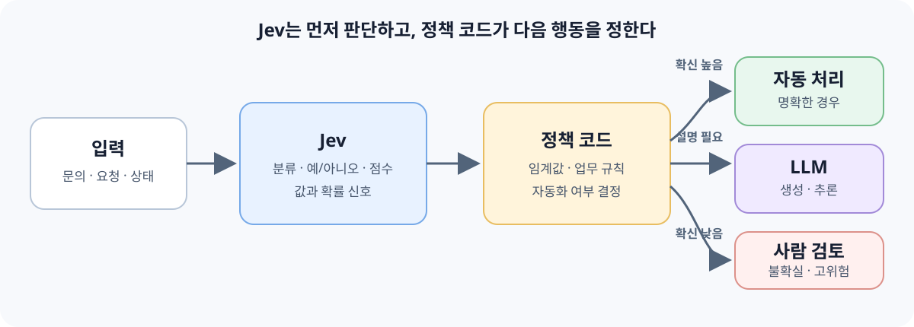

LLM은 말을 잘 만들고 복잡한 문제를 추론하는 데 강하다. 하지만 실무에서 파이프라인을 만들다 보면, 매번 필요한 것이 긴 답변이 아니라 "이 문의를 어디로 보낼까?", "이 요청은 위험한가?", "이 검색 결과를 컨텍스트에 넣을 가치가 있나?" 같은 짧은 판단일 때가 많다. 그런데도 이 짧은 판단을 위해 프롬프트를 쓰고, JSON으로 출력하라고 지시하고, 파싱이 깨질 가능성을 대비하고, 응답을 몇 초씩 기다린다.

이런 판단을 더 빠르고 구조적으로 처리하자는 흐름에서 TypeSafe AI는 **2026년 9월 15일** Jev를 공개했다. 회사가 붙인 이름은 **System One Model**이다. 아직 Early Access 단계라 성능·가격·API는 바뀔 수 있지만, 관심을 끄는 지점은 특정 제품보다도 LLM과 다른 종류의 모델을 함께 쓰는 설계에 있다. 이번 글에서는 Jev가 무엇을 다르게 하는지, 그 출력을 어떻게 읽어야 하는지, 그리고 공개 한 달이 지나며 독립 검증에서 어떤 평가를 받고 있는지 정리해보고자 한다.

## 생성하는 AI와 결정하는 AI

LLM은 다음에 올 토큰을 차례로 만들어 답을 생성한다. 그래서 요약, 번역, 코드 작성처럼 결과 자체가 문장이나 코드인 일에 유연하다. 반대로 업무 자동화에서는 결과가 "billing 부서", "환불 요청: 예", "긴급도: 높음"처럼 정해진 값이면 충분한 경우가 많다. 이때 긴 문자열을 만들고 다시 프로그램이 해석하는 방식은 필요한 것보다 무겁다.

Jev는 이 문제를 **생성 대신 판단**으로 다룬다. 입력으로 텍스트나 구조화된 상태(state)를 받고, 미리 정의한 형태의 값과 그 판단의 확률 정보를 돌려주는 방식이다. TypeSafe는 이를 "정리되지 않은 상태를 넣고, 타입이 정해진 확률적 판단을 받는" 모델로 소개한다. 창업자의 표현을 빌리면 "frontier-intelligence function call"에 가깝다.

여기서 중요한 것은 Jev가 텍스트를 **아예 만들지 않는다**는 점이다. 설명하지 않고, 요약하지 않고, 근거를 쓰지 않는다. 질문에 대한 답과 확률만 돌려주고 멈춘다. 처음에는 제약처럼 보이지만, 이 제약이 타입 안정성과 지연 시간을 동시에 가져오는 교환이다.

| 구분 | LLM | Jev 같은 판단 모델 |
|---|---|---|
| 주된 역할 | 답변·설명·코드 생성 | 분류·선택·예/아니오·점수 판단 |
| 출력 | 자유로운 문자열 | 미리 정의한 구조의 값과 확률 정보 |
| 파싱 | 프롬프트로 유도하고 실패를 대비해야 함 | 스키마가 출력 공간을 정의함 |
| 지연 | 수백 ms ~ 수십 초 | 수십 ~ 수백 ms 수준으로 보고됨 |
| 잘 맞는 일 | 요약, 응답 작성, 다단계 추론 | 라우팅, 위험 판정, 우선순위 분류 |

## 세 가지 질문 타입

Jev의 API는 "state + questions"라는 한 가지 모양을 가진다. 판단 대상 상태를 넣고, 코드에서 정의한 질문들을 함께 보내면, 각 질문에 대한 답이 돌아온다. 질문의 종류는 세 가지(primitive)다.

| 타입 | 쓰는 경우 | 돌려주는 것 |
|---|---|---|
| `Choice` | 순서 없는 고정된 후보 중 하나 선택 | 선택값, 후보별 확률, confidence |
| `Score` | 순서가 있는 척도에서 정도 평가 | 점수, 단계 설명, 확률, confidence |
| `Noul` | 예/아니오 판단 | 0~1 사이 확률 하나 |

공식 문서와 초기 튜토리얼에 나온 형태를 기준으로 하면, 호출은 대략 이런 모양이다. Early Access 단계라 SDK 표면은 바뀔 수 있으니 구조를 보는 용도로 읽는 편이 좋다.

```python
from typesafe_sdk import Choice, Noul, Score, TypeSafeClient

client = TypeSafeClient()

response = client.system_one(
    state={"ticket": ticket_text},
    questions={
        # 어느 부서로 보낼지
        "queue": Choice(
            instructions="`ticket`을 처리할 담당 큐는 어디인가?",
            criteria={
                "billing": "결제, 환불, 청구서와 관련된 문의다.",
                "technical": "제품이 동작하지 않거나 오류가 보고된다.",
                "account": "로그인, 권한, 계정 설정에 대한 문의다.",
                "unclear": "위 어디에도 분명히 들어가지 않는다.",
            },
        ),
        # 환불을 요구하는지
        "wants_refund": Noul(
            instructions="`ticket`에서 환불이나 결제 취소를 요구하고 있는가?",
        ),
        # 얼마나 급한지
        "urgency": Score(
            instructions="`ticket`의 긴급도는 어느 정도인가?",
            criteria=[
                "단순 문의이고 기다릴 수 있다.",
                "사용자가 불편을 느끼지만 작업은 가능하다.",
                "작업이 멈췄고 당일 대응이 필요하다.",
                "데이터 손실이나 보안 위험이 관련된다.",
            ],
        ),
    },
)
```

응답은 질문별로 나뉘어 돌아온다.

```python
queue = response.choices["queue"]
queue.choice         # "billing"
queue.probabilities  # {"billing": 0.94, "technical": 0.03, ...}
queue.confidence     # 0.91

response.nouls["wants_refund"].noul   # 0.87
response.scores["urgency"].score      # 2
```

문서에서 반복되는 권고가 하나 있다. **질문을 크게 묻지 말고 쪼개라는 것**이다. "이 문의를 어떻게 처리해야 하는가"처럼 여러 요인이 섞인 질문을 한 번에 던지는 대신, 요인마다 별도 질문으로 묻고 그 결과를 코드 로직으로 합치라고 안내한다. 가중치와 우선순위를 모델의 속마음에 맡기지 않고 코드에 명시하게 되므로, 나중에 정책이 바뀌었을 때 고칠 지점이 분명해진다.

`Choice`의 criteria를 label만 적지 말고 설명까지 쓰라는 권고, 그리고 `unclear` 같은 탈출 선택지를 항상 넣으라는 권고도 같은 맥락이다. 후보 집합이 현실을 다 덮지 못하면 모델은 어쨌든 그 중 하나를 고른다. 애매함을 받아낼 칸이 없으면 애매함이 오답으로 바뀐다.

## 왜 지금 'System 1'인가

심리학에서 System 1은 빠르고 자동적인 판단, System 2는 느리고 의식적인 추론을 가리킨다. 카너먼의 『생각에 관한 생각』에서 온 구분이고, TypeSafe가 모델 이름을 여기서 가져왔다. 이를 AI에 그대로 대응시키는 것은 비유에 가깝지만, 최근의 제품 개발이 주로 System 2 쪽에 집중해 왔다는 관찰 자체는 틀리지 않다. 추론 모델은 어려운 수학이나 복잡한 코드 문제에서 더 오래 생각하며 성능을 끌어올렸다. 그 성과는 분명하지만, 모든 요청이 어려운 추론을 필요로 하지는 않는다.

스팸 판정이나 문의 분류처럼 답이 짧고 반복되는 과제라면, 큰 추론 모델을 매번 쓰는 것이 지연과 비용을 늘릴 수 있다. 핵심은 더 똑똑한 모델 하나를 모든 일에 쓰는 것이 아니라, **간단한 판단은 빠른 모델에 맡기고 어려운 추론은 LLM에 맡기는 것**이다. Jev의 System 1이라는 표현은 이 빈자리를 겨냥한다.

숫자로는 지연 70~500ms, 입력 토큰 100만 개당 $0.042, 출력 토큰은 무료라는 조건이 제시됐다. 전통적인 분류 모델을 직접 학습해서 서빙하는 것과 비교하면 라벨도 인프라도 필요 없다는 점이 다르고, LLM으로 분류하던 것과 비교하면 자리수가 다른 비용이다. 다만 이 가격은 Early Access 기준이고, 정식 출시 시점에 바뀔 수 있다는 전제를 깔아두는 편이 안전하다.

## 핵심은 답뿐 아니라 판단의 불확실성

일반적인 분류 결과가 `billing` 하나뿐이라면, 프로그램은 그 결과가 확실한지 경계선에 걸친 선택인지 알기 어렵다. Jev는 결과 후보의 확률 분포와 confidence 같은 신호를 함께 제공하는 것을 설계 중심에 둔다. 그러면 시스템은 확신이 충분할 때 자동 처리하고, 애매한 경우에는 사람에게 넘기는 정책을 코드로 만들 수 있다.

```python
AUTO_ROUTE_CONFIDENCE = 0.75
YES = 0.8

def route(response):
    if response.nouls["wants_refund"].noul > YES:
        return "billing", "refund_flow"

    queue = response.choices["queue"]
    if queue.confidence < AUTO_ROUTE_CONFIDENCE:
        return queue.choice, "human_first"

    return queue.choice, "auto"
```

여기서 probability와 confidence를 구분해서 읽어야 한다. probability는 후보별 가능성이고, confidence는 그 분포가 한쪽으로 얼마나 몰렸는지를 하나의 값으로 요약한 지표다. `[0.90, 0.06, 0.04]`는 confidence가 높고 `[0.40, 0.33, 0.27]`은 낮다. 즉 confidence는 "이 답이 맞을 확률"이 아니라 "모델의 판단이 갈리지 않았는지"에 더 가깝다. `Noul`에 별도 confidence가 없는 이유도 여기에 있다. 0~1 사이의 숫자 자체가 이미 믿음의 정도여서, 0.5는 '중간 정도 그렇다'가 아니라 '모르겠다'로 읽어야 한다. 정도를 재고 싶으면 `Score`를 써야 한다.

`Score`에도 주의할 점이 있다. 단계는 순서가 있지만 숫자 간격이 균일하게 보정된 값은 아니다. 2와 3 사이를 2.4로 보간하거나 평균을 내서 지표로 쓰는 식의 사용은 문서에서도 권하지 않는다. 임계값을 나누는 용도로 쓰는 것이 설계 의도에 맞다.

그리고 모델이 내놓은 `0.9`를 곧바로 "실제 정답률 90%"라고 해석해서는 안 된다. 독립 테스트에서 Jev는 익숙한 영어 과제에서는 비교 대상 중 보정 품질이 가장 좋은 편으로 보고됐지만(공개 벤치마크 ECE 중앙값 약 0.071), 도메인에 따라 편차가 컸다. 다중 클래스 과제에서는 과신하고, 합성 데이터에서는 과소 확신하는 경향이 보고됐다. 같은 테스트는 **자기 데이터에서 50개에서 수백 개 정도의 라벨로 temperature를 맞추는 것만으로 보정 오차가 크게 줄었다**고 정리한다. 확률을 돌려준다는 점은 유용한 입력이지만, 그 자체로 안전성이나 정확성을 보장하지는 않는다는 뜻이다.

특히 자동 승인·계정 정지처럼 오류 비용이 큰 결정에서는 임계값과 사람 검토 경로를 신중히 설계해야 한다. 질문 타입마다 분포의 모양이 다르므로, `Choice`에서 쓴 0.75를 `Noul`에 그대로 옮기는 것도 피하는 편이 좋다.

## 질문을 한 번에 여러 개 묻는다는 것

여러 판단을 한 번에 물어도 서로 간섭하지 않도록 병렬 평가한다는 점도 Jev의 핵심 주장이다. LLM 프롬프트 하나에 부서 분류·긴급도·환불 여부를 함께 넣으면, 토큰을 순서대로 생성하는 과정에서 앞의 판단이 뒤의 판단에 영향을 줄 수 있다. "긴급도: 높음"을 먼저 쓰고 나면 그다음 판단이 그 문맥에 끌려가는 식이다. Jev는 한 입력에 대한 여러 질문을 같은 state에 대해 독립적으로 동시에 평가한다.

실무에서 이게 주는 효과는 두 가지다. 첫째, 질문을 추가해도 응답 시간이 거의 늘지 않는다. 문서도 "질문을 추가하는 것이 응답 시간을 거의 바꾸지 않는다"고 표현한다. 둘째, 그래서 **나중에 필요할지도 모르는 질문을 미리 함께 물어보는 것**이 합리적인 선택이 된다. 한 공개 사례에서는 13개 질문을 한 번의 호출로 묶어 개별 호출 대비 약 10배 빠르고 12배 저렴했다고 보고한다. 분기 하나를 타고 나서 추가 호출을 하는 대신, 분기마다 필요한 판단을 처음부터 다 받아두고 코드가 골라 쓰는 방식이 된다.

이 특징도 시스템 설계상의 장점으로 이해하되, 실제 운영 전에 우리 업무 데이터에서 결과의 일관성과 정확도를 점검해야 한다.

## 매니저 역할은 어떻게 달라질까

처음 Jev를 보고 메모에 적었던 해석은 "LLM 앞에서 매니저처럼 작동하는 agent"였다. 방향은 맞지만, 정확히는 그 매니저 전체가 LLM에서 Jev로 바뀐다기보다 매니저가 하던 일 중 **분류·라우팅·위험도 판단 같은 결정 부분**을 판단 모델에 맡기는 구조에 가깝다. 답변을 만들거나 여러 단계를 추론해야 하는 일은 여전히 LLM의 몫이다.

예를 들면 고객 문의를 Jev가 분류하고 확률을 평가한다. 확신이 낮으면 사람에게 보내고, 충분히 높으면 어떤 LLM을 부를지 코드가 정한다. 선택된 LLM이 고객에게 설명을 쓰거나 문제를 해결한다. 즉 판단 모델은 길잡이 역할을 하고, LLM은 필요한 곳에서 생성과 추론을 맡는다. **목표는 LLM을 걷어내는 것이 아니라, LLM 앞에 판단 계층을 두어 둘을 함께 쓰는 것**이다.



이 구조에서 눈여겨볼 점은 AI 호출이 두 번으로 나뉘면서 **의사결정의 책임 소재가 분명해진다**는 것이다. 판단 모델은 값과 확률을 제공하고, 자동화할지 사람에게 넘길지는 코드가 결정한다. 프롬프트 안에 숨어 있던 정책이 if 문으로 올라오는 셈이다. 로그를 남기고 임계값을 조정하고 A/B로 비교하는 일도 그만큼 쉬워진다.

## 실제로는 어디에 쓰이고 있나

공개 한 달 사이에 축적된 사용 사례를 보면, 적용 지점이 생각보다 agent 파이프라인 내부에 몰려 있다.

- **검색 결과 재정렬**: agent가 웹 검색 결과를 읽기 전에 후보별로 `Noul` 하나를 물어 걸러낸다. 컨텍스트에 들어가는 노이즈를 줄이는 용도다. 법률 검색 사례에서 top-1 정확도가 5%에서 18%로 올랐다는 보고가 있다.
- **인용 검증**: LLM이 만든 문장이 출처 문단의 뒷받침을 받는지 `Choice`로 "뒷받침한다 / 반박한다 / 언급 없음" 중에서 고르게 한다. 없는 인용을 잡아내는 데 쓴다.
- **도구 호출 안전장치**: 코딩 agent가 명령을 실행하기 전에 "이 작업은 되돌릴 수 없는가"를 묻는다. 수백 ms 수준이면 실행 경로에 끼워 넣을 만하다.
- **프롬프트 인젝션 탐지**: 외부에서 가져온 페이지를 컨텍스트에 넣기 전에 관련성, 근거 유무, 모순, 인젝션 시도를 각각 `Noul`로 묻는다.
- **모델 라우팅**: 요청의 난이도와 의도를 추정하고, 어떤 LLM을 부를지는 코드가 고른다. Vercel이 AI Gateway에 Jev를 올리면서 AI SDK에서 바로 쓸 수 있게 된 것도 이 패턴을 밀었다.
- **대량 분류**: 크롤링한 문서를 일괄 라벨링한다. 페이지 유형, deprecated 여부, 코드 예제 포함 여부를 한 번에 묻는 식이다.

공통점이 보인다. 전부 **"다른 모델이나 파이프라인의 출력을 판정하는 자리"**다. 생성의 자리를 빼앗는 게 아니라 생성 앞뒤에 검문소를 세우는 쓰임이다.

## 숫자를 어떻게 읽어야 할까

마케팅 숫자와 독립 검증 결과가 꽤 다르다는 점은 짚어둘 필요가 있다.

TypeSafe는 자체 평가에서 "193.6배 빠르고 444.6배 저렴하다"고 발표했다. 그런데 이 평가는 네 가지 워크플로를 회사의 내부 팀이 구성한 것이고, 더 중요하게는 **정답의 정의가 GPT-6 Astra와 Fable 5.1의 예측 평균**이다. 즉 절대 정확도가 아니라 두 프런티어 모델과 얼마나 일치하는지를 측정한 수치이고, 그 일치율 자체는 평균 67.8% 수준이다. 속도·비용 배수도 "원래 LLM으로 분류를 하고 있었다면"이라는 전제가 붙을 때 성립한다.

공개 후 여러 독립 테스트를 모아보면 그림은 이렇다. 6개 모델 비교에서 정확도 72.5%로 중간 가격대 LLM과 비슷한 수준이고, 프런티어 모델보다는 6.5~11.5%p 낮았다. 가장 규모가 큰 사전등록 연구(사람 라벨 7,977개)에서는 15개 과제 중 14개에서 최고 성능 LLM에 뒤졌고, 중앙값 기준 F1 11.6점 차이였다. 과제별로 라벨을 모아 전용 모델을 학습한 경우에는 측정된 모든 사례에서 Jev보다 나았다.

알려진 실패 유형도 분명하다.

- 산술, 개수 세기, 날짜 비교에 약하다. 날짜를 순서가 있는 값으로 다루지 못한다.
- 다단계 추론이 필요한 질문에서 정확도가 떨어진다.
- state가 크고 노이즈가 많으면 판단이 흔들린다.
- state 안의 적대적 문장에 답이 끌려갈 수 있다.
- 선택지 표현에 민감하다. 한 연구에서는 yes/no 라벨 순서를 바꿨을 때 응답의 32.5%가 달라졌다.
- 영어 밖에서는 성능이 떨어진다. 러시아어에서 88.3% → 77.3%로 떨어진 측정이 있다. 한국어 과제라면 이 부분을 직접 확인해야 한다.

"hallucination이 0%"라는 표현도 정확히 읽어야 한다. 이는 출력이 항상 스키마에 맞는다는 뜻이고, **스키마에 맞는 틀린 값**은 여전히 나온다. 타입 오류가 사라진 것과 판단이 맞는 것은 다른 문제다.

그리고 커뮤니티에서는 "결국 분류 모델을 재발견한 것"이라는 지적도 나왔다. 실제로 오픈 가중치 모델의 logit을 읽어 같은 인터페이스를 재현한 OpenJev 같은 프로젝트가 금방 등장했고, Qwen3.5-4B 기반으로 102개 표본에서 0.845 일치(Jev 공개값 0.883)를 기록했다. 모델 자체의 격차보다 "타입이 정해진 판단 API"라는 인터페이스가 더 큰 기여였다는 해석이 가능한 지점이다.

이 숫자들은 Jev를 쓰지 말라는 근거는 아니다. 다만 **"프런티어 LLM을 대체한다"가 아니라 "중간 가격대 LLM 수준의 판단을 훨씬 싸고 빠르게, 라벨과 인프라 없이 얻는다"**로 기대치를 맞추는 것이 현실에 가깝다.

## 어떤 문제에 어울릴까

판단 모델은 선택지가 정해져 있고, 같은 판단을 반복하며, 그 결과에 따라 프로그램이 다음 행동을 정하는 문제에 잘 맞는다. 문의 분류, 스팸 판정, 요청 우선순위, 검색 결과의 적합성 판단 등이 예다. 반대로 새로운 답변을 써야 하거나, 긴 설명·요약·코드·복잡한 추론이 필요하면 생성형 LLM이 적합하다. 현재는 텍스트 입력만 받으므로 이미지나 음성이 판단 근거라면 앞단에서 텍스트로 바꿔야 한다.

그리고 모든 판단을 모델에 맡길 필요도 없다. 결정 경로를 보면 보통 세 층으로 나뉜다.

1. 규칙으로 충분한 것은 규칙으로 남긴다. 금액 한도, 블랙리스트, 상태 전이 같은 것은 모델에 물을 일이 아니다.
2. 반복적이지만 문맥 이해가 필요한 판단은 Jev 같은 모델로 평가한다.
3. 확장된 설명과 다단계 추론은 LLM으로 넘긴다.

따라서 Jev를 볼 때의 질문은 "LLM을 대체할 수 있을까?"가 아니다. **"우리 시스템에서 어떤 결정을 빠르고 측정 가능하게 떼어낼 수 있을까?"**에 가깝다. 떼어낸 뒤에는 confidence 기준, 사람 검토 경로, 실제 정확도와 비용을 검증한다. 이런 구성에서 AI는 판단 자료를 제공하고, 최종 동작과 정책은 코드가 통제한다.

## 정리

Jev를 보면서 흥미로웠던 것은 모델 성능보다 인터페이스였다. "정리되지 않은 상태를 넣고 타입이 정해진 확률적 판단을 받는다"는 형태는, LLM을 쓰면서 계속 임시로 때워왔던 자리를 정면으로 다룬다. JSON 출력을 유도하는 프롬프트, 파싱 실패 대비 코드, 프롬프트 안에 뒤섞인 업무 정책 같은 것들이다.

지금까지 확인한 것을 정리하면 이렇다.

- Jev는 텍스트를 생성하지 않고, 정해진 타입의 판단과 확률만 돌려주는 모델이다.
- 질문 타입은 `Choice`(선택), `Score`(척도), `Noul`(예/아니오 확률) 세 가지다.
- 한 state에 대한 여러 질문을 병렬·독립으로 평가하므로, 질문을 쪼개고 미리 많이 묻는 편이 유리하다.
- 판단을 합치는 로직은 모델이 아니라 코드에 두는 것이 설계 의도다.
- confidence는 "맞을 확률"이 아니라 분포가 몰린 정도다. 임계값은 질문 타입별로 따로 잡아야 한다.
- 보정은 기본값이 괜찮은 편이지만, 자기 데이터 수십~수백 건으로 다시 맞추는 편이 훨씬 낫다.
- 산술, 날짜, 다단계 추론, 비영어 과제는 약점으로 보고돼 있다.
- 벤더 벤치마크는 프런티어 모델과의 일치율이고 절대 정확도가 아니다. 독립 테스트에서는 중간 가격대 LLM 수준이다.
- 스키마에 맞는 출력이 보장되는 것과 판단이 맞는 것은 다른 문제다.

개인적으로는 이 모델을 당장 도입할지보다, 지금 만들고 있는 파이프라인에서 LLM에게 묻고 있는 질문 중 **실제로는 판단이었던 것들**을 분리해볼 만하다는 생각이 들었다. 분리해두면 Jev를 쓰든, 작은 분류 모델을 학습하든, 계속 LLM을 쓰든 선택지가 생긴다. 반대로 분리하지 않으면 그 판단은 계속 프롬프트 안에서 보이지 않게 작동한다. 결국 더 중요한 것은 어떤 모델을 고르는가가 아니라, 시스템의 결정 지점을 눈에 보이게 만드는 일인 것 같다.

## 참고

- Introducing System One Models & Jev — TypeSafe AI: https://typesafe.ai/blog/introducing-system-one-models-and-jev
- TypeSafe AI Docs — System One: https://docs.typesafe.ai/concepts/system-one
- TypeSafe AI Docs — Introduction: https://docs.typesafe.ai/introduction
- What Is Jev? Inside TypeSafe's Decision-Only AI Model and Its Developer Use Cases: https://www.firecrawl.dev/blog/what-is-jev
- Jev After Eight Days of Independent Tests: https://dev.to/gde/jev-after-eight-days-of-independent-tests-level-with-mid-price-llms-behind-the-frontier-1kln
- JEV Choice, Score and Noul: Question Types and Confidence: https://ahmetbalaman.com/en/blog/jev-choice-score-noul-question-types-en/
- OpenJev: https://github.com/zhangcy122/OpenJev
- Jev 따라하기: LLM과 다른 의사결정 AI 시작하기: https://wikidocs.net/book/21376
