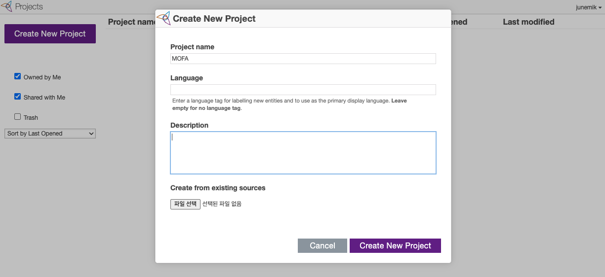
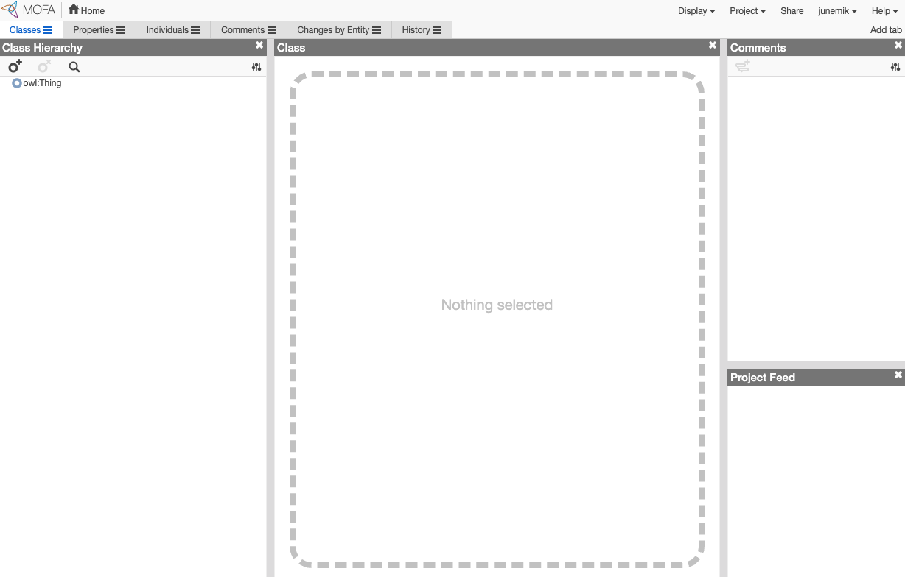
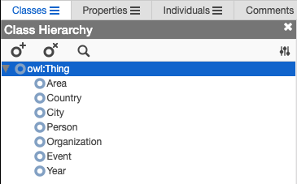
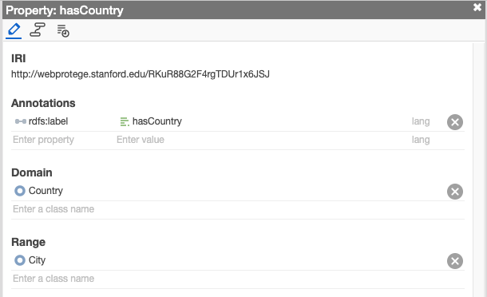
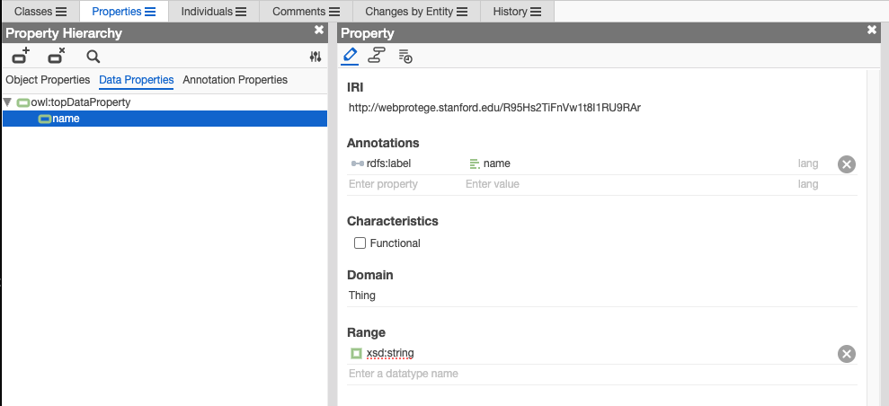
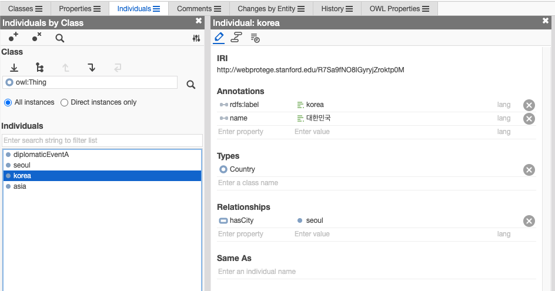

`지식그래프`, `온톨로지`, `protege`, `neo4j`

GraphRAG 기반 AI 시스템 프로젝트에서 그래프 구축 업무도 담당하게 되면서 막연하게 주먹구구 식으로 지식 그래프에 대해서 기초가 부족함을 느껴서 정리가 필요하다고 느껴져 온톨로지부터 그래프 데이터베이스까지 일단 간략하게 짚어보면서 기록해두려고 한다.


핵심 개념부터 미리 정리하고 시작하자면, 
온톨로지는 데이터를 저장하기 위한 구조라기보다, 도메인 지식의 의미와 관계를 명시적으로 표현하는 모델이고
Protege는 이 모델을 시각적으로 설계하고 검증하는 도구,
Neo4j는 그 지식을 그래프 형태로 탐색하고 애플리케이션에서 활용하기 좋은 실행 환경으로서 그래프 DBMS라고 생각하면 될 것 같다.

예시로는 외교부의 OPENDATA에 온톨로지 모델이라고 공개된 데이터가 있어서 업무상 사용하던 교육 도메인 대신해서 설명하려고 한다. (https://opendata.mofa.go.kr/lod/ontologyModel.do)

## 지식 그래프와 온톨로지는 무엇이 다를까?

지식 그래프(Knowledge Graph)는 개체와 개체 사이의 관계를 그래프 구조로 표현한 것이다. 그래프에서 노드는 국가, 도시, 인물, 사건 같은 개체가 되고, 엣지는 `속한다`, `포함한다`, `관련된다`, `발생했다` 같은 관계가 된다.

온톨로지는 그 그래프를 어떤 개념과 관계로 구성할지 정의하는 의미 모델이다. 지식 그래프가 실제 데이터를 연결한 결과물이라면, 온톨로지는 그 데이터를 어떤 타입과 관계로 해석할지 정해두는 설계도에 가깝다.

```text
온톨로지: 그래프에 들어갈 개념, 관계, 제약을 정의하는 모델
지식 그래프: 온톨로지에 따라 실제 개체와 관계를 연결한 데이터
```

외교부 OPEN DATA의 온톨로지 모델을 보면 이 차이를 이해하기 쉽다. 이 모델은 지역, 국가, 도시, 인물, 기관, 사건, 연도를 Core 온톨로지의 핵심 클래스로 두고, 발간자료, 브리핑, 보도자료, 외교일지 같은 문서 데이터와 연결한다.


위 그림은 실제 개별 데이터가 연결된 지식 그래프라기보다, 어떤 클래스가 있고 클래스 사이에 어떤 Object Property가 놓일 수 있는지를 보여주는 온톨로지 Class 연관도다. 그림의 일부를 단순화하면 이런 구조로 표현해 볼 수 있다.

```text
(Area)-[:hasCountry]->(Country)
(Country)-[:hasCity]->(City)
(Person)-[:hasPosition]->(Position)
(Event)-[:relatedPerson]->(Person)
```

여기서 `Area`, `Country`, `City`, `Person`, `Event`는 실제 데이터가 아니라 데이터의 타입인 거다. 반면에 실제 지식 그래프에는 이 모델을 따라 개별 인스턴스가 들어간다.

```text
(아시아)-[:hasCountry]->(대한민국)
(대한민국)-[:hasCity]->(서울)
(외교행사A)-[:relatedPerson]->(인물A)
```

즉 온톨로지는 `Country`와 `City`가 어떻게 연결될 수 있는지를 정의하고, 지식 그래프는 `대한민국`과 `서울`이 실제로 연결되어 있다는 사실을 담는다. 이 차이를 분리해서 봐야 뒤에서 다룰 Protege와 Neo4j의 역할도 헷갈리지 않는다.

클래스별로 어떤 속성과 관계를 가질 수 있는지는 온톨로지 Property 도식에서 더 구체적으로 볼 수 있다. 예를 들어 국가에는 관련 문서, 사건, 지역, 도시 같은 속성이나 관계가 붙을 수 있고, 사건에는 관련 국가, 관련 인물, 발생 일자 같은 정보가 연결될 수 있다.


GraphRAG까지 미리 얘기를 조금 해보면, 벡터 검색이 의미적으로 가까운 문서를 찾는 데 강하다면, 지식 그래프는 이렇게 명시한 관계를 따라 맥락을 확장하는 데 강하다. 그리고 이 온톨로지는 어떤 관계를 명시적으로 만들 것인지 결정하는 기준이 되어준다.

## 온톨로지의 기본 구성 요소

온톨로지를 처음 볼 때 가장 헷갈리는 부분은 클래스, 인스턴스, 프로퍼티의 구분이다. 

### Class

Class는 개념의 종류다. 예를 들어 `Area`, `Country`, `City`, `Person`, `Organization`, `Event`, `Year` 같은 것들이 클래스가 된다.

```text
Thing
 ├── Area
 ├── Country
 ├── City
 ├── Person
 ├── Organization
 ├── Event
 └── Year
```

클래스는 실제 데이터 하나하나가 아니라, 데이터가 속할 수 있는 타입이다. 그러니까 `대한민국`은 클래스가 아니라 `Country` 클래스에 속하는 개체가 된다.

### Individual

Individual은 실제 개체다. 이후 Neo4j 같은 그래프 DB로 옮기면 보통 노드에 대응된다.

```text
Class: Country
Individual: 대한민국

Class: City
Individual: 서울

Class: Event
Individual: 외교행사A
```

프로그래밍에 비유하면 Class는 타입이고, Individual은 객체 인스턴스에 가깝다. (회사에서도 이렇게 비유를 해드리곤 했다,,, )

### Object Property

Object Property는 개체와 개체 사이의 관계다. 그래프 DB로 옮기면 보통 노드 사이의 관계, 즉 엣지에 대응된다.

```text
아시아 hasCountry 대한민국
대한민국 hasCity 서울
외교행사A relatedPerson 인물A
```

여기서 `hasCountry`, `hasCity`, `relatedPerson`이 Object Property다. 관계의 양쪽이 모두 개체라는 점이 중요하다.

### Data Property

Data Property는 개체와 값 사이의 관계다.

```text
대한민국 name "대한민국"
서울 name "서울"
외교행사A date "2026-05-31"
```

여기서 `name`, `date`는 문자열, 날짜, 숫자 같은 리터럴 값을 가진다.

정리하면 다음과 같다.

| 구성 요소 | 의미 | 예시 |
| --- | --- | --- |
| Class | 개념의 종류 | `Area`, `Country`, `City`, `Person`, `Event` |
| Individual | 실제 개체 | `아시아`, `대한민국`, `서울`, `외교행사A` |
| Object Property | 개체 간 관계 | `hasCountry`, `hasCity`, `relatedPerson` |
| Data Property | 개체와 값의 관계 | `name`, `date`, `description` |

## RDF, RDFS, OWL

온톨로지를 다루다 보면 RDF, RDFS, OWL이라는 용어가 계속 등장한다.

RDF(Resource Description Framework)는 지식을 `주어 - 술어 - 목적어` 형태의 triple로 표현하는 방식이다.

```text
아시아 - hasCountry - 대한민국
대한민국 - hasCity - 서울
외교행사A - relatedPerson - 인물A
대한민국 - name - "대한민국"
```

이 triple이 쌓이면 그래프가 된다. 주어는 노드가 되고, 술어는 관계가 된다. 목적어가 `서울` 같은 개체라면 노드가 되고, `"대한민국"` 같은 리터럴 값이라면 노드의 속성값처럼 해석할 수 있다.

RDFS는 RDF에 클래스, 하위 클래스, 도메인, 레인지 같은 기본 의미를 추가한다.

```text
Country subClassOf Place
City subClassOf Place
hasCity domain Country
hasCity range City
```

위 정의는 `hasCity`라는 관계를 쓰는 주어를 `Country`, 목적어를 `City`로 해석하겠다는 의미를 준다. RDFS/OWL에서는 이것이 단순한 폼 검증 규칙이라기보다 타입 추론에 쓰이는 의미 선언에 가깝다.

OWL(Web Ontology Language)은 더 풍부한 논리 표현을 가능하게 한다. 예를 들어 클래스 간 동치, 분리, 제약, 추론 규칙을 더 정교하게 표현할 수 있다.

```text
CapitalCity subClassOf City
Country disjointWith City
DiplomaticEvent equivalentTo Event and relatedCountry some Country
```

이런 정의가 있으면 reasoner가 새로운 사실을 추론하거나 모순을 찾아낼 수 있다.

## Reasoner는 온톨로지의 테스트 러너

Protege에서 온톨로지를 만들 때 reasoner를 함께 사용한다. Reasoner는 온톨로지의 논리 구조를 검사하고, 명시적으로 쓰지 않은 사실을 추론해준다.

예를 들어 다음과 같이 클래스 계층을 정의했다고 하자.

```text
CapitalCity subClassOf City
City subClassOf Place
```

그리고 `서울`을 `CapitalCity`라고 지정하면, reasoner는 `서울`이 `City`이자 `Place`이기도 하다고 추론할 수 있다.

```text
서울 type CapitalCity
=> 서울 type City
=> 서울 type Place
```

반대로 모순도 잡을 수 있다.

```text
Country disjointWith City
대한민국 type Country
대한민국 type City
```

`Country`와 `City`가 서로 겹칠 수 없다고 정의했는데 `대한민국`이 둘 다에 속한다면 논리적으로 문제가 된다. 이런 부분을 reasoner가 알려준다.

개인적으로는 reasoner를 온톨로지의 테스트 러너처럼 이해하면 편했다. 코드를 작성한 뒤 테스트를 돌리듯, 온톨로지를 설계한 뒤 reasoner를 돌려 모델이 의도대로 동작하는지 확인하는 것이다.

## Protege로 온톨로지 설계하기


Protégé는 OWL 온톨로지를 시각적으로 만들고 검증할 수 있는 편집 도구다. 스탠퍼드의 Protégé 프로젝트에서 제공하는 무료 오픈소스 도구이고, Desktop 버전과 협업용 WebProtégé가 모두 OWL 2를 지원한다. 온톨로지 관리 도구는 여러 가지가 있지만, Protege는 널리 쓰이는 도구 중 하나로 보인다.
예시로 WebProtégé에서 간단하게 외교부 LOD처럼 지역, 국가, 도시, 인물, 기관, 사건을 연결하는 온톨로지를 만들어보자.




처음에는 탭과 메뉴가 많아서 복잡해 보이지만, 기본 흐름은 단순하다.




```text
1. Ontology IRI 설정
2. Class 계층 정의
3. Object Property 정의
4. Data Property 정의
5. Individual 추가
6. Reasoner 실행
7. OWL 또는 Turtle 형식으로 저장
```


### 1. Ontology IRI 정하기

온톨로지는 고유한 식별자를 가진다. 보통 URL 형태의 IRI를 사용한다.

```text
http://webprotege.stanford.edu/RKuR88G2F4rgTDUr1x6JSJ
```

이 IRI는 실제로 접속 가능한 URL일 필요는 없지만, 전역적으로 충돌하지 않는 namespace 역할을 한다. ~~웹 프로테제에서 생성하니 위처럼 생성됐다.~~

### 2. 클래스 계층 만들기

Protege의 `Entities > Classes` 탭에서 +버튼을 눌러 클래스 계층을 만든다.

```text
Thing
 ├── Area
 ├── Country
 ├── City
 ├── Person
 ├── Organization
 ├── Event
 └── Year
```
위 클래스를 하나씩 추가하고 나면 아래처럼 확인할 수 있다. 




여기서 중요한 것은 실제 데이터와 개념을 섞지 않는 것이다. `Country`는 클래스지만 `대한민국`은 개별 국가 인스턴스다. `City`는 클래스지만 `서울`은 개별 도시 인스턴스다. `Event`는 클래스지만 특정 외교 행사나 사건명은 Individual로 두는 편이 자연스럽다.

### 3. Object Property 만들기

다음으로 개체 간 관계를 정의한다.

프로테제에서는 Properties 탭 > Object Properties 탭 선택 후 동일하게 + 버튼을 눌러 추가한다. 



```text
hasCountry
  domain: Area
  range: Country

hasCity
  domain: Country
  range: City

relatedOrganization
  domain: Event
  range: Organization

relatedPerson
  domain: Event
  range: Person

relatedCountry
  domain: Event
  range: Country
```

`domain`은 이 관계를 쓰는 주어 쪽 클래스, `range`는 목적어 쪽 클래스를 의미한다. 다만 OWL/RDFS에서 domain과 range는 단순 입력 검증 규칙이라기보다 타입 의미를 부여하는 선언에 가깝다. 예를 들어 `hasCity`의 domain이 `Country`, range가 `City`라면 다음과 같은 관계를 의도한다.

```text
Country hasCity City
```

### 4. Data Property 만들기

Data Property는 문자열, 날짜, 숫자 같은 값을 표현한다.

```text
name
  domain: Thing
  range: xsd:string

date
  domain: Event
  range: xsd:date

description
  domain: Event
  range: xsd:string
```

이렇게 해두면 국가, 도시, 인물, 사건 개체에 이름, 발생일, 설명 같은 값을 붙일 수 있다.

비슷하게 Properties > Data Properties 탭에서 추가한다.




### 5. Individual 추가하기

마지막으로 Individuals 탭에서 실제 개체를 추가한다.



Individual을 추가하고 끝나는 것이 아니라, 캡쳐의 오른쪽 창에서 각 Individual이 어떤 클래스에 속하는지 (Types), 어떤 값과 관계를 가지는지 (Relationships) 함께 선언해야 한다. OWL에서는 이런 선언을 Assertion이라고 부른다. 예를 들어 `korea`가 `Country` 타입이라는 선언은 Class Assertion이고, `korea hasCity seoul`처럼 Individual 사이의 관계를 선언하는 것은 Object Property Assertion이다. `name "대한민국"`처럼 리터럴 값을 붙이는 것은 Data Property Assertion이다.

```text
Individual: asia
  type: Area
  name: "아시아"

Individual: korea
  type: Country
  name: "대한민국"

Individual: seoul
  type: City
  name: "서울"

Individual: diplomaticEventA
  type: Event
  name: "외교행사A"
  date: "2026-05-31"

Assertion:
  Class Assertion:
    asia type Area
    korea type Country
    seoul type City
    diplomaticEventA type Event

  Data Property Assertion:
    asia name "아시아"
    korea name "대한민국"
    seoul name "서울"
    diplomaticEventA name "외교행사A"
    diplomaticEventA date "2026-05-31"

  Object Property Assertion:
    asia hasCountry korea
    korea hasCity seoul
    diplomaticEventA relatedCountry korea
```

이 단계까지 오면 클래스와 프로퍼티로 만든 온톨로지 구조 위에 일부 샘플 데이터를 얹어 확인할 수 있다.

쓰다보니 길어져 이 온톨로지를 기반으로 실제 그래프를 만들어서 그래프 데이터베이스 (Neo4j)에 적재하고 RAG로 활용하는 것까지는 다음 글에 이어서...