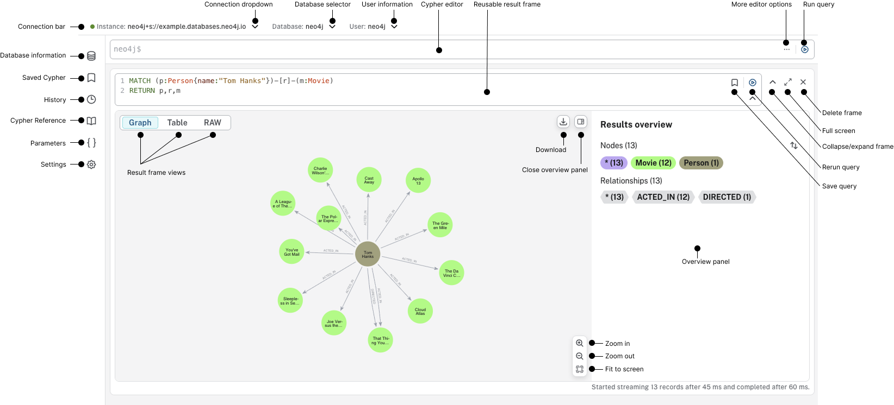
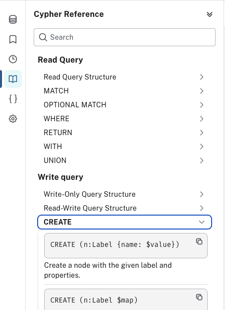

`지식그래프`, `온톨로지`, `protege`, `neo4j`, `neosemantics`, `cypher`

GraphRAG 기반 AI 시스템 프로젝트에서 그래프 구축 업무도 담당하게 되면서 막연하게 주먹구구 식으로 지식 그래프에 대해서 기초가 부족함을 느껴서 정리가 필요하다고 느껴져 온톨로지부터 그래프 데이터베이스까지 일단 간략하게 짚어보면서 기록해두려고 한다.

앞 글에서는 지식 그래프와 온톨로지의 차이, 그리고 WebProtégé에서 지역, 국가, 도시, 인물, 기관, 사건을 연결하는 간단한 온톨로지를 만들어보는 과정까지 정리했다. 이번 글에서는 그 온톨로지를 Neo4j 쪽으로 가져와서 실제 그래프처럼 탐색해보는 과정을 정리한다.

이번 글의 목표는 이렇다.

```text
1. RDF/OWL과 Neo4j property graph의 차이를 이해한다.
2. 온톨로지를 참고해서 Neo4j 그래프 모델을 직접 만든다.
3. Turtle 예시 데이터를 만들어 Neo4j에 적재한다.
4. neosemantics(n10s)로 RDF/OWL 데이터를 가져오는 흐름을 이해한다.
5. Cypher로 국가, 도시, 사건 관계를 탐색한다.
6. GraphRAG에서는 이 그래프를 어떻게 쓸 수 있을지 정리한다.
```

## Neo4j와 RDF/OWL은 같은 그래프일까?

Neo4j는 RDF triple store가 아니라 property graph database다. 그래서 OWL/RDF 세계와 Neo4j 세계의 모델이 완전히 같지는 않다.

RDF는 기본적으로 triple 중심이다.

```text
subject - predicate - object
```

예를 들어 앞 글에서 만든 데이터를 RDF처럼 쓰면 다음과 같다.

```text
asia hasCountry korea
korea hasCity seoul
diplomaticEventA relatedCountry korea
diplomaticEventA relatedPerson personA
korea name "대한민국"
```

Neo4j는 노드, 관계, 속성 중심이다.

```cypher
(:Area {name: "아시아"})-[:HAS_COUNTRY]->(:Country {name: "대한민국"})
(:Country {name: "대한민국"})-[:HAS_CITY]->(:City {name: "서울"})
(:Event {name: "외교행사A"})-[:RELATED_COUNTRY]->(:Country {name: "대한민국"})
```

둘 다 그래프를 다루지만, 질의 언어와 데이터 모델이 다르고, 그에 따라 용어도 조금 다르다.

| 구분 | RDF/OWL | Neo4j |
| --- | --- | --- |
| 기본 단위 | Triple | Node, Relationship, Property |
| 질의 언어 | SPARQL | Cypher |
| 강점 | 표준화된 의미 표현, 추론 | 빠른 그래프 탐색, 애플리케이션 연동 |
| 대표 도구 | Protege, RDF store | Neo4j Browser, Neo4j Bloom |

그래서 Neo4j를 쓴다고 해서 OWL reasoner처럼 모든 의미 추론이 자동으로 수행된다고 기대하면 안 된다. Protege에서는 온톨로지의 논리적 구조를 설계하고 검증하고, Neo4j에서는 그 구조를 실제 그래프 탐색과 서비스 연동에 맞게 활용한다고 보는 편이 현실적이다.

## 핸즈온 준비

이 글은 로컬 Neo4j Desktop 또는 로컬 Neo4j 서버 기준으로 생각했다. Aura 같은 관리형 환경에서는 플러그인 설치나 로컬 파일 import 정책이 다를 수 있으니, 처음 실습할 때는 로컬 환경이 편하다.

준비물은 다음 정도면 충분하다.

```text
Neo4j Desktop 또는 Neo4j Server
Neo4j Browser
neosemantics(n10s) 플러그인
앞 글에서 만든 온톨로지 또는 아래 Turtle 예시
```

Neo4j Browser는 Cypher를 실행하고 결과 그래프를 바로 확인할 수 있는 기본 UI다. 아래는 Neo4j 공식 Browser 문서의 화면 예시다.



Neo4j에서 RDF/OWL 데이터를 다루려면 보통 neosemantics, 줄여서 n10s 플러그인을 사용한다. Neo4j의 n10s 문서에서는 이 플러그인이 RDF, RDFS, OWL, SKOS 같은 semantic web 데이터를 Neo4j에서 사용할 수 있게 해준다고 설명한다.

전체 흐름은 다음과 같다.

```text
Protege에서 온톨로지 작성
        ↓
OWL 또는 Turtle 파일로 저장
        ↓
Neo4j에 neosemantics 플러그인 설정
        ↓
Graph Config 초기화
        ↓
온톨로지 또는 RDF 데이터 import
        ↓
Cypher로 탐색
```

다만 실습 관점에서는 두 가지 경로를 나눠서 보는 것이 좋다.

```text
방법 A:
  온톨로지를 참고해서 Neo4j property graph를 직접 만든다.

방법 B:
  RDF/OWL 파일을 neosemantics로 가져온다.
```

처음 공부할 때는 방법 A가 더 직관적이고, RDF/OWL 파일 자체를 다뤄야 하는 경우에는 방법 B가 필요하다.

## 방법 A. 온톨로지를 참고해서 Neo4j 그래프 직접 만들기

먼저 n10s 없이 Neo4j만으로 그래프를 만들어보자. 온톨로지 요소를 Neo4j 요소로 대응시키면 다음과 같다.

Neo4j Browser에서는 쿼리 에디터에 Cypher를 입력하고 실행하면 된다. Cypher 문법이 헷갈릴 때는 Browser 안의 Cypher Reference 패널도 같이 참고할 수 있다.



| 온톨로지 요소 | Neo4j 요소 | 예시 |
| --- | --- | --- |
| Class | Label | `Area`, `Country`, `City`, `Event` |
| Individual | Node | `asia`, `korea`, `seoul`, `diplomaticEventA` |
| Object Property | Relationship | `HAS_COUNTRY`, `HAS_CITY`, `RELATED_COUNTRY` |
| Data Property | Node Property | `name`, `date`, `description` |

### 1. 제약 조건 만들기

중복 노드를 피하려면 먼저 고유 식별자에 제약 조건을 걸어두는 것이 좋다.

```cypher
CREATE CONSTRAINT area_id IF NOT EXISTS
FOR (n:Area)
REQUIRE n.id IS UNIQUE;

CREATE CONSTRAINT country_id IF NOT EXISTS
FOR (n:Country)
REQUIRE n.id IS UNIQUE;

CREATE CONSTRAINT city_id IF NOT EXISTS
FOR (n:City)
REQUIRE n.id IS UNIQUE;

CREATE CONSTRAINT event_id IF NOT EXISTS
FOR (n:Event)
REQUIRE n.id IS UNIQUE;

CREATE CONSTRAINT person_id IF NOT EXISTS
FOR (n:Person)
REQUIRE n.id IS UNIQUE;
```

Neo4j 5 계열에서는 위처럼 `CREATE CONSTRAINT ... IF NOT EXISTS` 문법을 사용할 수 있다. 이미 같은 이름의 제약 조건이 있으면 새로 만들지 않는다.

### 2. 노드 만들기

앞 글에서 만든 Individual을 Neo4j 노드로 옮긴다.

```cypher
MERGE (asia:Area {id: "asia"})
SET asia.name = "아시아";

MERGE (korea:Country {id: "korea"})
SET korea.name = "대한민국";

MERGE (seoul:City {id: "seoul"})
SET seoul.name = "서울";

MERGE (personA:Person {id: "personA"})
SET personA.name = "인물A";

MERGE (event:Event {id: "diplomaticEventA"})
SET event.name = "외교행사A",
    event.date = date("2026-05-31");
```

`MERGE`는 같은 패턴이 있으면 재사용하고, 없으면 생성한다. 실습을 여러 번 반복할 수 있어서 `CREATE`보다 안전하다.

### 3. 관계 만들기

Object Property는 Neo4j의 Relationship으로 옮긴다.

```cypher
MATCH (asia:Area {id: "asia"})
MATCH (korea:Country {id: "korea"})
MERGE (asia)-[:HAS_COUNTRY]->(korea);

MATCH (korea:Country {id: "korea"})
MATCH (seoul:City {id: "seoul"})
MERGE (korea)-[:HAS_CITY]->(seoul);

MATCH (event:Event {id: "diplomaticEventA"})
MATCH (korea:Country {id: "korea"})
MERGE (event)-[:RELATED_COUNTRY]->(korea);

MATCH (event:Event {id: "diplomaticEventA"})
MATCH (personA:Person {id: "personA"})
MERGE (event)-[:RELATED_PERSON]->(personA);
```

이렇게 하면 이전 글에서 만든 Assertion이 Neo4j property graph로 옮겨진다.

```text
asia hasCountry korea
korea hasCity seoul
diplomaticEventA relatedCountry korea
diplomaticEventA relatedPerson personA
```

### 4. 제대로 들어갔는지 확인하기

전체 그래프를 작게 확인한다.

```cypher
MATCH (n)
RETURN labels(n) AS labels, n
LIMIT 25;
```

관계만 확인하고 싶다면 이렇게 본다.

```cypher
MATCH (a)-[r]->(b)
RETURN a.name AS from,
       type(r) AS relationship,
       b.name AS to
ORDER BY from, relationship, to;
```

대한민국에 속한 도시를 찾는 쿼리는 다음과 같다.

```cypher
MATCH (:Country {name: "대한민국"})-[:HAS_CITY]->(city:City)
RETURN city.name AS city;
```

대한민국과 관련된 사건을 찾는 쿼리는 다음과 같다.

```cypher
MATCH (event:Event)-[:RELATED_COUNTRY]->(:Country {name: "대한민국"})
RETURN event.name AS event, event.date AS date
ORDER BY date;
```

특정 사건에서 국가, 도시, 인물까지 확장해볼 수도 있다.

```cypher
MATCH (event:Event {id: "diplomaticEventA"})
OPTIONAL MATCH (event)-[:RELATED_COUNTRY]->(country:Country)
OPTIONAL MATCH (country)-[:HAS_CITY]->(city:City)
OPTIONAL MATCH (event)-[:RELATED_PERSON]->(person:Person)
RETURN event.name AS event,
       collect(DISTINCT country.name) AS countries,
       collect(DISTINCT city.name) AS cities,
       collect(DISTINCT person.name) AS people;
```

이 방식의 장점은 단순하고 서비스에 바로 쓰기 좋다는 것이다. 반대로 단점은 OWL/RDF의 의미 정보를 직접 챙겨야 한다는 점이다. 예를 들어 `CapitalCity subClassOf City` 같은 클래스 계층을 Neo4j 라벨로 어떻게 반영할지, `domain`과 `range`를 어떻게 검증할지, `sameAs` 같은 연결을 어떻게 처리할지는 별도로 설계해야 한다.

## 방법 B. neosemantics로 RDF/OWL 가져오기

이번에는 RDF/OWL 파일을 Neo4j에 직접 가져오는 흐름을 보자.

먼저 Turtle 예시 파일을 하나 준비한다. Protege에서 export해도 되고, 실습용으로 아래 내용을 `mofa-sample.ttl`로 저장해도 된다.

```turtle
@prefix ex: <http://example.com/mofa-sample#> .
@prefix owl: <http://www.w3.org/2002/07/owl#> .
@prefix rdf: <http://www.w3.org/1999/02/22-rdf-syntax-ns#> .
@prefix rdfs: <http://www.w3.org/2000/01/rdf-schema#> .
@prefix xsd: <http://www.w3.org/2001/XMLSchema#> .

ex:Area a owl:Class .
ex:Country a owl:Class .
ex:City a owl:Class .
ex:Event a owl:Class .
ex:Person a owl:Class .

ex:hasCountry a owl:ObjectProperty ;
  rdfs:domain ex:Area ;
  rdfs:range ex:Country .

ex:hasCity a owl:ObjectProperty ;
  rdfs:domain ex:Country ;
  rdfs:range ex:City .

ex:relatedCountry a owl:ObjectProperty ;
  rdfs:domain ex:Event ;
  rdfs:range ex:Country .

ex:relatedPerson a owl:ObjectProperty ;
  rdfs:domain ex:Event ;
  rdfs:range ex:Person .

ex:name a owl:DatatypeProperty ;
  rdfs:range xsd:string .

ex:date a owl:DatatypeProperty ;
  rdfs:domain ex:Event ;
  rdfs:range xsd:date .

ex:asia a ex:Area ;
  ex:name "아시아" ;
  ex:hasCountry ex:korea .

ex:korea a ex:Country ;
  ex:name "대한민국" ;
  ex:hasCity ex:seoul .

ex:seoul a ex:City ;
  ex:name "서울" .

ex:personA a ex:Person ;
  ex:name "인물A" .

ex:diplomaticEventA a ex:Event ;
  ex:name "외교행사A" ;
  ex:date "2026-05-31"^^xsd:date ;
  ex:relatedCountry ex:korea ;
  ex:relatedPerson ex:personA .
```

Neo4j에서 `file:///mofa-sample.ttl`로 읽으려면 보통 Neo4j의 import 디렉터리에 파일을 둔다. Neo4j Desktop을 사용한다면 해당 DBMS 또는 Database의 import 폴더 위치를 확인해 그 안에 파일을 넣으면 된다.

### 1. n10s 설치 확인

Neo4j Browser에서 n10s 프로시저가 보이는지 확인한다.

```cypher
SHOW PROCEDURES
YIELD name
WHERE name STARTS WITH "n10s."
RETURN name
ORDER BY name;
```

목록이 비어 있다면 neosemantics 플러그인이 설치되지 않았거나 DBMS가 재시작되지 않은 것이다. Neo4j Desktop에서는 보통 플러그인 메뉴에서 설치하고 DB를 재시작한다. 서버 설치라면 Neo4j 버전에 맞는 n10s `.jar` 파일을 plugins 디렉터리에 넣고 재시작해야 한다.

### 2. Graph Config 초기화

n10s로 RDF를 가져오기 전에 `:Resource(uri)`에 대한 유니크 제약 조건을 만든다. n10s 공식 문서에서도 `n10s.rdf.import.fetch`는 `:Resource(uri)` 유니크 제약 조건이 필요하다고 설명한다.

```cypher
CREATE CONSTRAINT n10s_unique_uri IF NOT EXISTS
FOR (r:Resource)
REQUIRE r.uri IS UNIQUE;
```

그 다음 Graph Config를 초기화한다.

```cypher
CALL n10s.graphconfig.init({
  handleVocabUris: "SHORTEN",
  handleMultival: "ARRAY"
});
```

설정이 들어갔는지 확인한다.

```cypher
CALL n10s.graphconfig.show();
```

여기서 `handleVocabUris: "SHORTEN"`은 긴 URI를 줄여서 다루기 위한 설정이다. RDF 데이터는 원래 `http://example.com/mofa-sample#hasCity`처럼 긴 IRI를 쓰기 때문에, 그대로 관계명으로 쓰면 Neo4j에서 보기 불편하다. `SHORTEN`을 사용하면 prefix 기반으로 줄인 이름이 만들어진다.

`handleMultival: "ARRAY"`는 같은 속성이 여러 값을 가질 때 배열로 저장하게 한다. RDF에서는 같은 predicate가 여러 번 나올 수 있기 때문에 이 설정을 명시해두면 실습 결과를 이해하기 쉽다.

주의할 점은 Graph Config는 빈 그래프에서 먼저 잡는 것이 좋다는 것이다. 이미 RDF 데이터를 import한 뒤에 설정을 바꾸면 기존 데이터와 새 데이터의 저장 방식이 달라질 수 있다.

### 3. import 전에 preview하기

바로 import하기 전에 preview를 해보면 좋다. n10s에는 RDF 데이터를 실제로 저장하기 전에 어떤 그래프 형태로 해석될지 미리 보는 기능이 있다.

```cypher
CALL n10s.rdf.preview.fetch(
  "file:///mofa-sample.ttl",
  "Turtle"
);
```

이 단계에서 파싱 에러가 난다면 파일 경로, Turtle 문법, prefix 선언을 먼저 확인한다. 실제로는 import보다 preview에서 문제를 먼저 잡는 편이 훨씬 편하다.

### 4. 온톨로지 구조만 가져오기

온톨로지의 클래스, 프로퍼티, `subClassOf`, `domain`, `range` 같은 구조를 가져올 때는 `n10s.onto.import.fetch`를 사용할 수 있다.

```cypher
CALL n10s.onto.import.fetch(
  "file:///mofa-sample.ttl",
  "Turtle"
);
```

이 프로시저는 온톨로지 구조를 가져오는 용도다. n10s 문서 기준으로 ontology import는 named class 선언, 명시적 class hierarchy, property 정의, property hierarchy, domain/range 정보를 가져오는 데 초점이 있다. 그래서 `ex:korea`, `ex:seoul` 같은 실제 Individual 데이터를 탐색하고 싶다면 RDF import도 함께 생각해야 한다.

### 5. RDF 인스턴스 데이터 가져오기

실제 RDF triple을 Neo4j에 넣을 때는 `n10s.rdf.import.fetch`를 사용한다.

```cypher
CALL n10s.rdf.import.fetch(
  "file:///mofa-sample.ttl",
  "Turtle"
);
```

이 프로시저는 URL이나 파일에서 RDF triple을 읽고 Neo4j property graph로 저장한다. import가 끝나면 로드된 triple 수와 namespace 정보가 반환된다.

가져온 뒤에는 먼저 전체 구조를 확인한다.

```cypher
MATCH (n)
RETURN labels(n) AS labels, n
LIMIT 25;
```

관계 타입도 확인한다.

```cypher
MATCH (s)-[p]->(o)
RETURN s.uri AS subject,
       type(p) AS predicate,
       o.uri AS object
LIMIT 25;
```

n10s로 import한 그래프는 직접 만든 property graph와 라벨/관계명이 다를 수 있다. 특히 `handleVocabUris` 설정에 따라 `hasCity`가 그대로 보일 수도 있고, prefix가 붙은 짧은 이름으로 보일 수도 있다. 그래서 import 후에는 “내가 예상한 Cypher를 바로 쓰기”보다 “실제 저장된 라벨과 관계명을 먼저 확인하기”가 중요하다.

## n10s import 방식과 직접 모델링 방식 비교

두 방식은 목적이 다르다.

| 방식 | 장점 | 주의점 |
| --- | --- | --- |
| Neo4j property graph 직접 모델링 | Cypher가 직관적이고 서비스 모델에 맞추기 쉽다 | RDF/OWL 의미를 직접 반영해야 한다 |
| n10s RDF import | RDF/OWL 파일을 그대로 가져오기 좋다 | Neo4j에 저장된 라벨/관계명이 설정에 따라 달라진다 |
| n10s ontology import | 클래스/프로퍼티 구조를 가져오기 좋다 | 실제 Individual 데이터 import와는 목적이 다르다 |

개인적으로는 공부할 때 다음 순서가 좋다고 느낀다.

```text
1. 먼저 Neo4j property graph로 수동 모델링한다.
2. Cypher로 노드와 관계 탐색을 익힌다.
3. 그 다음 n10s로 RDF/Turtle import를 해본다.
4. 두 결과가 어떻게 다르게 저장되는지 비교한다.
```

이렇게 하면 RDF/OWL과 Neo4j의 차이가 훨씬 명확해진다.

## 추론은 어디까지 기대할 수 있을까?

이 부분이 헷갈리기 쉽다. Protege에서는 reasoner를 통해 온톨로지의 논리적 일관성이나 암묵적 타입을 추론할 수 있다. Neo4j는 기본적으로 그런 OWL reasoner가 아니다.

다만 n10s에는 inference/reasoning 관련 절차와 함수가 있다. 예를 들어 클래스 또는 카테고리 계층을 그래프로 표현해두고, 어떤 노드가 상위 카테고리에도 속한다고 볼 수 있는지 질의 시점에 활용할 수 있다.

예를 들어 이런 계층이 있다고 해보자.

```text
CapitalCity subClassOf City
City subClassOf Place
```

Neo4j property graph에서는 이를 명시적인 관계로 표현할 수 있다.

```cypher
MERGE (capital:Category {name: "CapitalCity"})
MERGE (city:Category {name: "City"})
MERGE (place:Category {name: "Place"})
MERGE (capital)-[:SUBCLASS_OF]->(city)
MERGE (city)-[:SUBCLASS_OF]->(place);
```

그리고 실제 노드를 카테고리에 연결한다.

```cypher
MATCH (seoul:City {id: "seoul"})
MATCH (capital:Category {name: "CapitalCity"})
MERGE (seoul)-[:IN_CATEGORY]->(capital);
```

이렇게 두면 “서울은 CapitalCity이고, CapitalCity는 City의 하위 개념이고, City는 Place의 하위 개념이다”라는 구조를 그래프 탐색으로 따라갈 수 있다.

```cypher
MATCH (seoul {id: "seoul"})-[:IN_CATEGORY]->(cat:Category)
MATCH path = (cat)-[:SUBCLASS_OF*0..]->(upper:Category)
RETURN seoul.name AS node,
       collect(DISTINCT upper.name) AS inferredCategories;
```

이건 OWL reasoner 전체를 대체하는 것은 아니지만, GraphRAG에서 필요한 계층 확장에는 충분히 유용할 수 있다.

## GraphRAG 관점에서 활용하기

GraphRAG에서 중요한 것은 단순히 그래프 DB를 쓰는 것이 아니라, 어떤 노드를 만들고 어떤 관계를 연결할지 결정하는 것이다. 이때 온톨로지가 기준점 역할을 한다.

예를 들어 외교 데이터 도메인이라면 다음과 같은 질문이 먼저 필요하다.

```text
특정 사건은 어떤 국가, 도시, 인물과 연결되는가?
특정 국가는 어떤 지역에 속하고 어떤 도시를 포함하는가?
특정 인물은 어떤 기관, 직위, 사건과 연결되는가?
보도자료나 외교일지는 어떤 사건과 국가를 언급하는가?
질문에 답할 때 문서의 유사도뿐 아니라 어떤 명시적 관계를 따라갈 것인가?
```

Cypher로는 이런 식의 확장 질의를 만들 수 있다.

```cypher
MATCH (event:Event)-[:RELATED_COUNTRY]->(country:Country {name: "대한민국"})
OPTIONAL MATCH (event)-[:RELATED_PERSON]->(person:Person)
OPTIONAL MATCH (country)-[:HAS_CITY]->(city:City)
RETURN event.name AS event,
       collect(DISTINCT person.name) AS people,
       collect(DISTINCT city.name) AS cities;
```

RAG 파이프라인에 붙인다면 대략 이런 흐름이 된다.

```text
1. 사용자 질문에서 핵심 엔티티를 찾는다.
   예: 대한민국, 외교행사, 특정 인물

2. 벡터 검색으로 관련 문서를 찾는다.
   예: 보도자료, 브리핑, 외교일지

3. Neo4j에서 명시적 관계를 따라 맥락을 확장한다.
   예: 대한민국 -> 관련 사건 -> 관련 인물/도시/기관

4. 문서 검색 결과와 그래프 탐색 결과를 함께 프롬프트 컨텍스트로 넣는다.

5. 답변에는 어떤 문서와 어떤 관계를 근거로 삼았는지 남긴다.
```

Neo4j에는 공식 GraphRAG for Python 패키지도 있다. 이 패키지는 Neo4j 기반 RAG, 지식 그래프 빌더, 벡터 인덱스와 retriever를 다루는 기능을 제공한다. 다만 이 글에서는 먼저 온톨로지와 그래프 모델링의 감을 잡는 것이 목적이라, Python 패키지 실습은 다음 단계로 미뤄두는 편이 좋을 것 같다.

## 실습 중 자주 막히는 지점

정리하면서 가장 헷갈릴 만한 부분을 따로 적어두면 다음과 같다.

### 1. `file:///mofa-sample.ttl`을 못 읽는 경우

대부분 파일 위치 문제다. Neo4j는 아무 로컬 경로에서나 파일을 읽는 것이 아니라, 설정된 import 디렉터리를 기준으로 읽는 경우가 많다. `mofa-sample.ttl`을 Neo4j import 폴더에 넣고 다시 시도한다.

### 2. `n10s.rdf.import.fetch`가 제약 조건을 요구하는 경우

다음 제약 조건을 먼저 만든다.

```cypher
CREATE CONSTRAINT n10s_unique_uri IF NOT EXISTS
FOR (r:Resource)
REQUIRE r.uri IS UNIQUE;
```

### 3. 예시 Cypher의 관계명이 동작하지 않는 경우

n10s import 결과는 graph config 설정에 따라 관계명이 달라질 수 있다. 먼저 아래 쿼리로 실제 관계명을 확인한다.

```cypher
MATCH ()-[r]->()
RETURN DISTINCT type(r) AS relationship
ORDER BY relationship;
```

그 결과에 맞춰 `MATCH` 쿼리의 관계명을 바꿔야 한다.

### 4. ontology import를 했는데 Individual이 안 보이는 경우

`n10s.onto.import.fetch`는 온톨로지 구조를 가져오는 용도다. 실제 인스턴스 triple을 가져오려면 `n10s.rdf.import.fetch`를 사용한다.

### 5. Neo4j가 OWL 추론을 전부 해줄 거라고 기대하는 경우

Neo4j는 기본적으로 property graph database다. OWL reasoner처럼 동작한다고 보기보다는, 필요한 계층이나 관계를 그래프 구조로 표현하고 Cypher 또는 n10s inference 기능으로 활용한다고 이해하는 편이 맞다.

## 정리

이번 글에서 잡은 핵심 개념은 다음과 같다.

```text
온톨로지:
  도메인 지식의 개념과 관계를 정의하는 설계 기준

Neo4j:
  실제 그래프 데이터를 저장하고 Cypher로 탐색하는 그래프 DBMS

neosemantics:
  RDF/OWL 세계와 Neo4j property graph 세계를 연결해주는 플러그인

n10s.onto.import.fetch:
  Class, Property, subClassOf, domain, range 같은 온톨로지 구조를 가져올 때 사용

n10s.rdf.import.fetch:
  실제 RDF triple 데이터를 가져올 때 사용
```

결국 온톨로지와 Neo4j는 서로 대체 관계라기보다는 역할이 다르다. 온톨로지는 그래프가 담아야 할 의미의 기준을 세우고, Neo4j는 그 기준에 따라 만들어진 그래프를 실제 시스템에서 탐색하고 활용하는 실행 환경이 된다.

GraphRAG를 만든다면 이 순서로 접근하는 것이 좋아 보인다.

```text
1. 도메인 질문을 먼저 정한다.
2. 질문에 필요한 개체와 관계를 온톨로지로 정리한다.
3. Protege에서 모델을 검증한다.
4. Neo4j property graph로 직접 모델링하거나 n10s로 RDF를 가져온다.
5. Cypher로 탐색 가능한 관계를 확인한다.
6. 검색된 문서와 그래프 탐색 결과를 함께 RAG 컨텍스트로 사용한다.
```

처음에는 온톨로지, RDF, OWL, Neo4j, Cypher가 한꺼번에 나와서 복잡해 보이지만, 역할을 나눠보면 조금 단순해진다. Protege는 의미를 설계하는 도구이고, Neo4j는 연결된 데이터를 탐색하고 서비스에 붙이는 도구다.

참고로 더 공부해볼 만한 공식 문서는 다음과 같다.

- Neo4j Browser Visual Tour: https://neo4j.com/docs/browser/visual-tour/
- Neo4j neosemantics User Guide: https://neo4j.com/labs/neosemantics/5.14/
- Importing RDF Data: https://neo4j.com/labs/neosemantics/5.14/import/
- Configuring Neo4j to use RDF data: https://neo4j.com/labs/neosemantics/5.14/config/
- n10s Inferencing/Reasoning: https://neo4j.com/labs/neosemantics/5.14/inference/
- Neo4j GraphRAG for Python: https://neo4j.com/docs/neo4j-graphrag-python/current/
